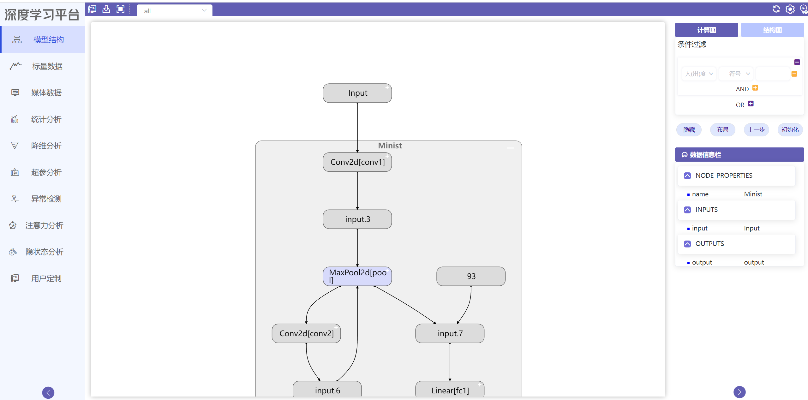

# 启动可视化并在浏览器中查看

在[上一节](quickstart.md)中，我们导出了Pytorch训练过程中的可视化日志。本节我们开始介绍如何启动可视化并在浏览器中进行查看。

在命令行执行命令

```
python main.py --logdir ./logs/torch/
```

命令行输出如下则启动可视化服务成功

```
Performing system checks...

System check identified no issues (0 silenced).
July 23, 2021 - 17:24:23
Django version 3.0.3, using settings 'backend.settings'
Starting development server at http://0.0.0.0:9898/
Quit the server with CTRL-BREAK.
```

默认情况下，可视化服务会启动在`http://127.0.0.1:9898`，打开浏览器访问即可查看可视化内容

{ .img-fluid }

关于更多可视化组件的使用和交互，请参考[使用可视化组件](use_visualization/graph)章节
