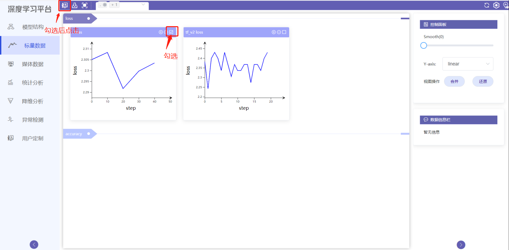
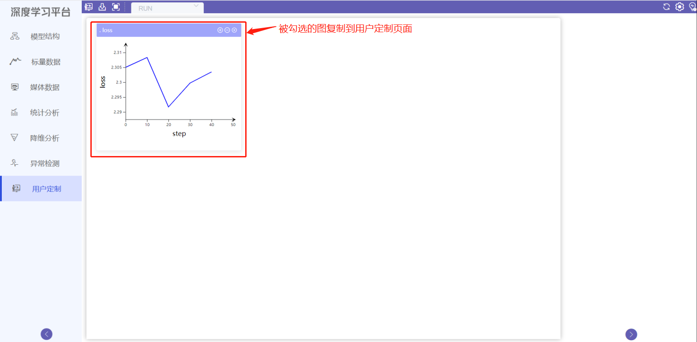
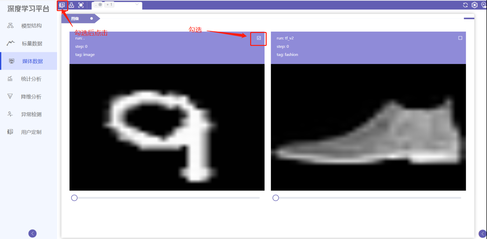
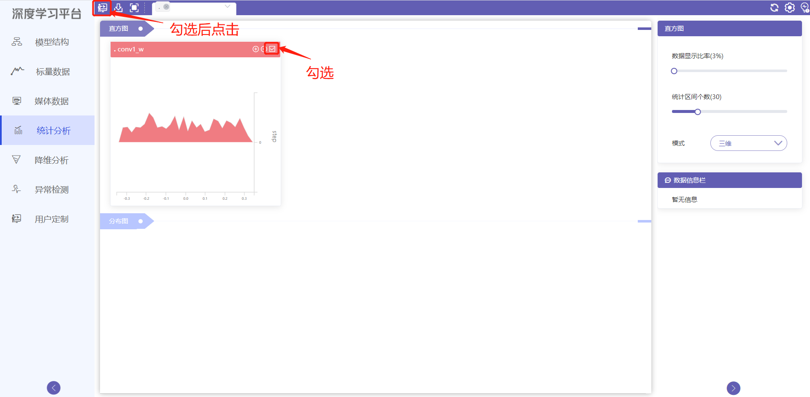
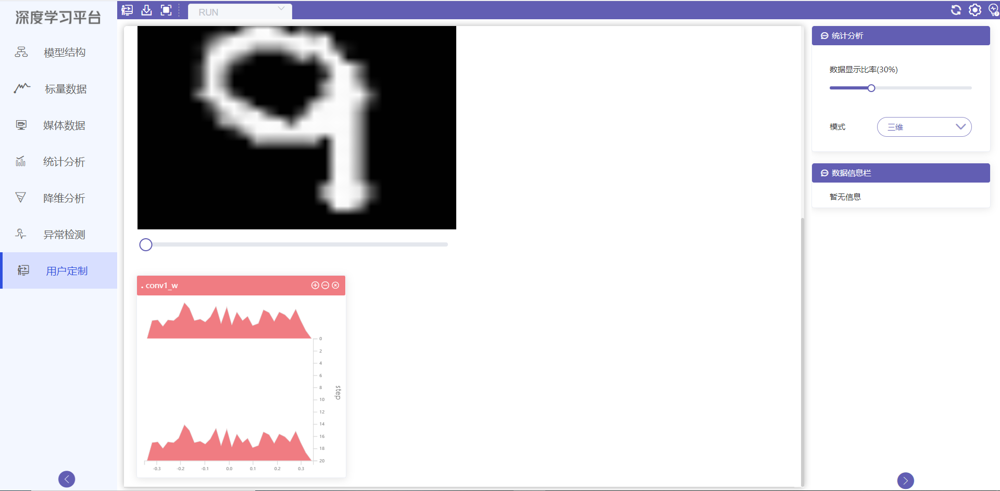

s# 用户定制使用教程
## 模块简介
用户定制可视化模块，可以将标量数据可视化模块、媒体数据可视化模块、统计分析可视化模块，方便用户单独放入用户定制可视化模块集中展示与分析。
## 模块功能

#### 将标量数据可视化模块、媒体数据可视化模块、统计分析可视化模块加入用户定制页面

勾选标量数据可视化模块中的数据，点击界面左上角图标

{ .img-fluid }

标量数据可视化模块中勾选的数据导入用户定制页面

{ .img-fluid }

勾选媒体数据可视化模块中的数据，点击界面左上角图标

{ .img-fluid }

勾选统计分析可视化模块中的数据，点击界面左上角图标

{ .img-fluid }

勾选的数据导入用户定制页面

{ .img-fluid }
