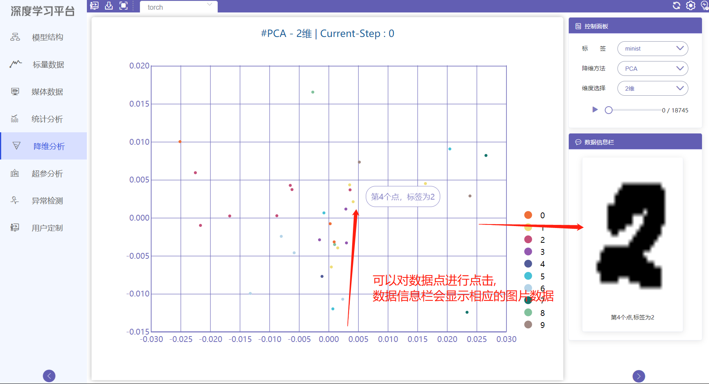
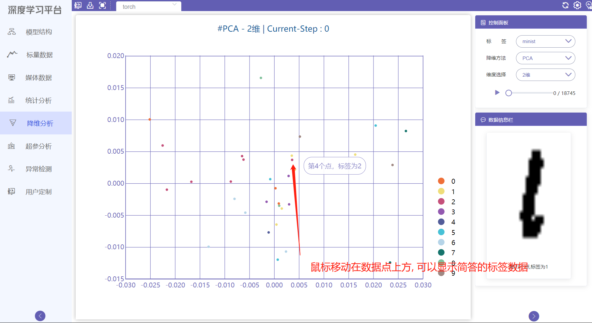
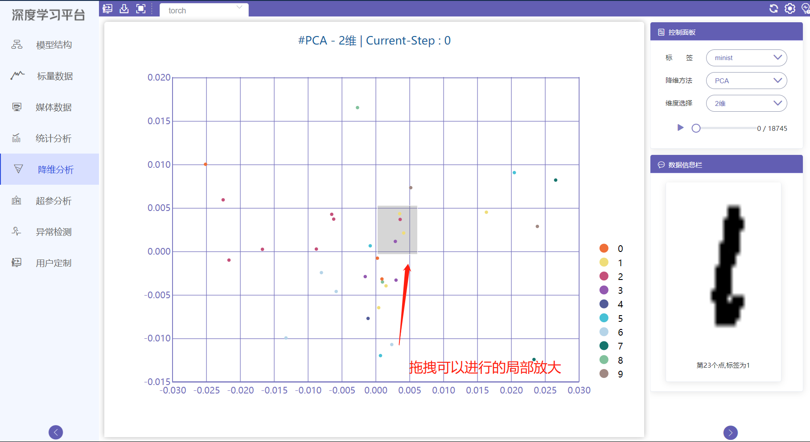
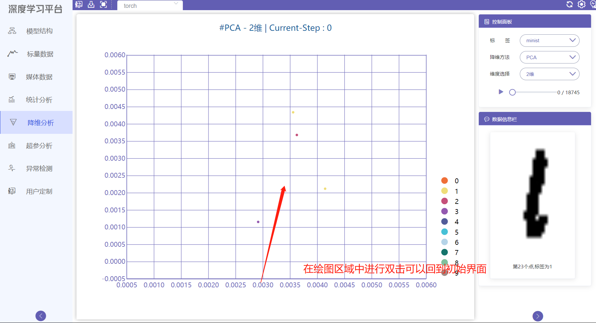
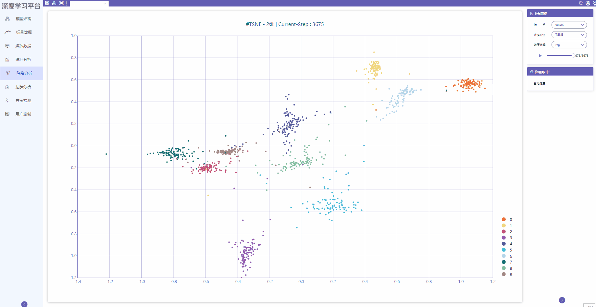
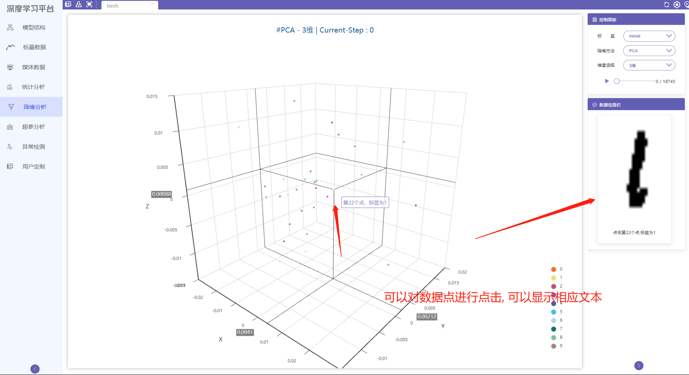
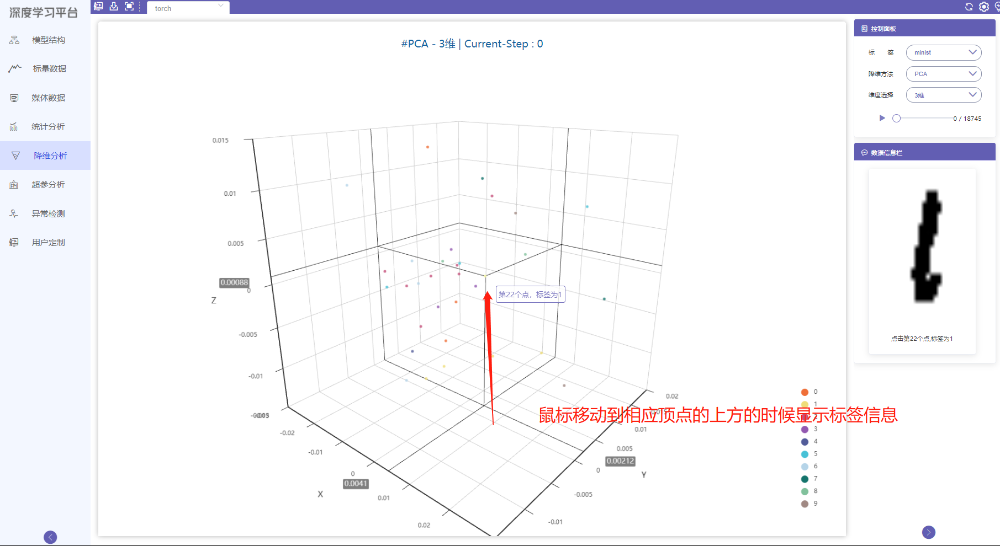
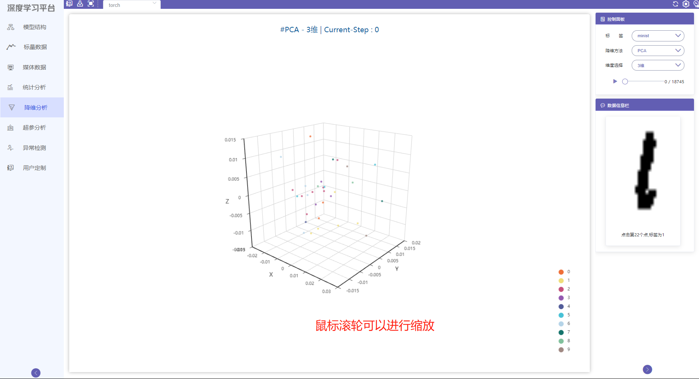
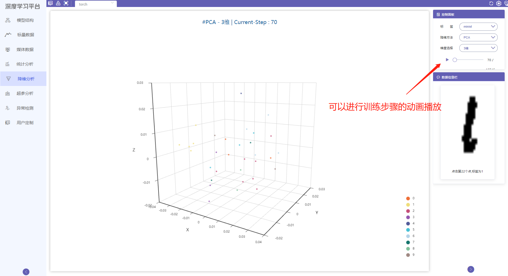
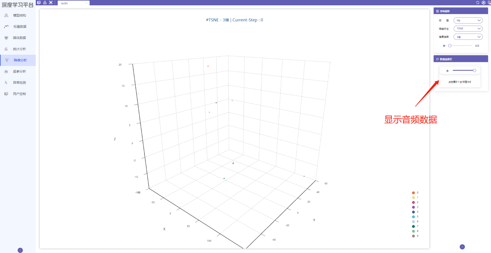

# 降维分析使用教程

降维分析页面用于展示高维数据降维分析可视化. 可以将高维数据降维并展示为 2 维, 3 维视图。

## 二维视图

* 可以对数据点进行点击,「数据信息栏」会显示对应数据点存储的图片或文本.

{ .img-fluid }

* 鼠标移动至数据点上时可以显示对应点的信息和标签.

{ .img-fluid }

* 拖拽可以对点进行局部放大.

{ .img-fluid }

* 双击显示窗口可以回到初始的显示界面.

{ .img-fluid }

* 可以以动画的形式展现随着训练的迭代, 查看训练的结果.

{ .img-fluid }

* 可以使用局部放大来进行查看为什么分类出现了错误.

如下图展示9图片被错误分类到了0分类集合中.

{ .img-fluid }

## 三维视图

* 可以对数据点进行点击，「数据信息栏」会显示对应数据点存储的图片或文本。

{ .img-fluid }

* 鼠标移动至数据点上时可以显示对应点的信息和标签。

{ .img-fluid }

* 鼠标滚轮可以进行缩放。

{ .img-fluid }

* 可以查看使用鼠标点击播放按钮查看训练效果.

{ .img-fluid }

* 可以以动画的形式展现随着训练的迭代, 查看训练的结果.

{ .img-fluid }

* 可以使用缩放来进行查看为什么分类出现了错误. 

如下图展示9图片被错误分类到了0分类集合中.

{ .img-fluid }

## 数据信息栏

显示对应的数据(文字,图片和音频),以及对应的数据点和标签。

{ .img-fluid }
