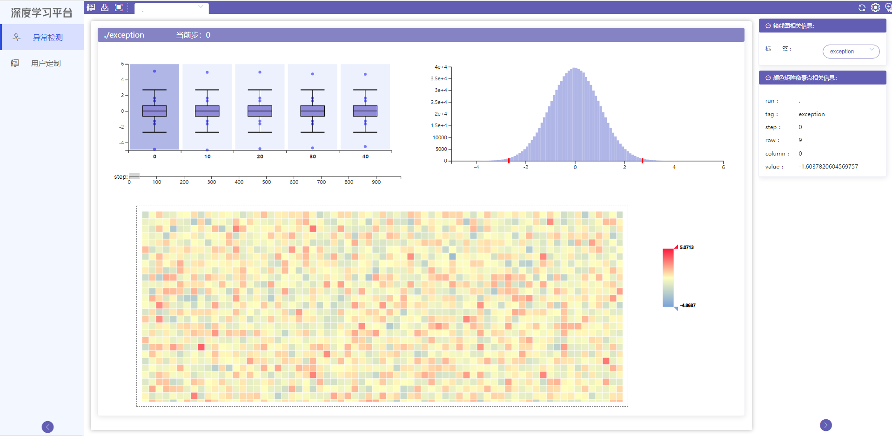
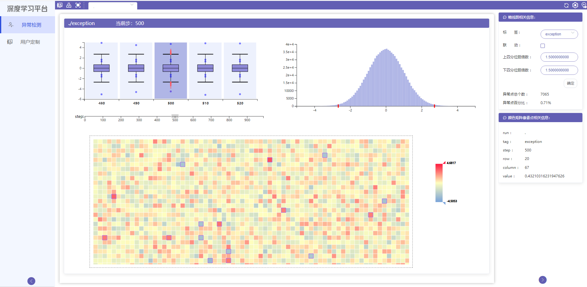
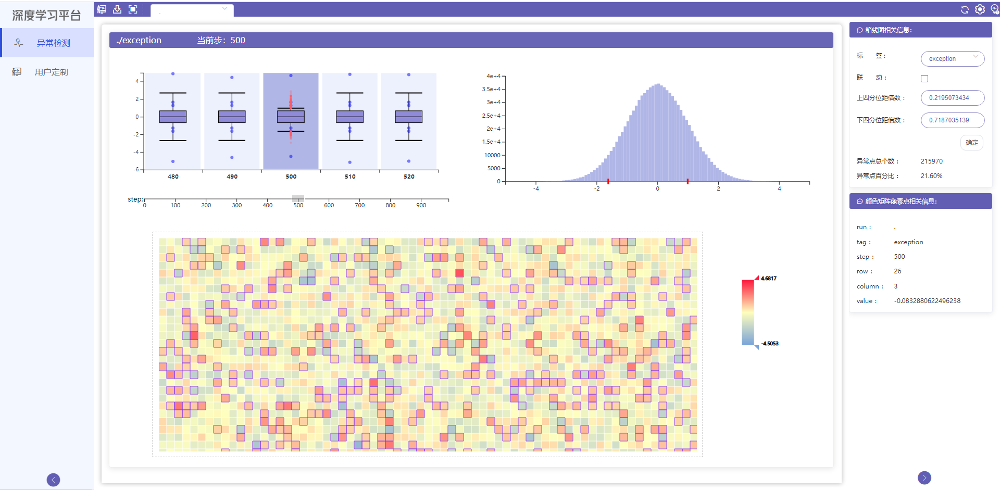
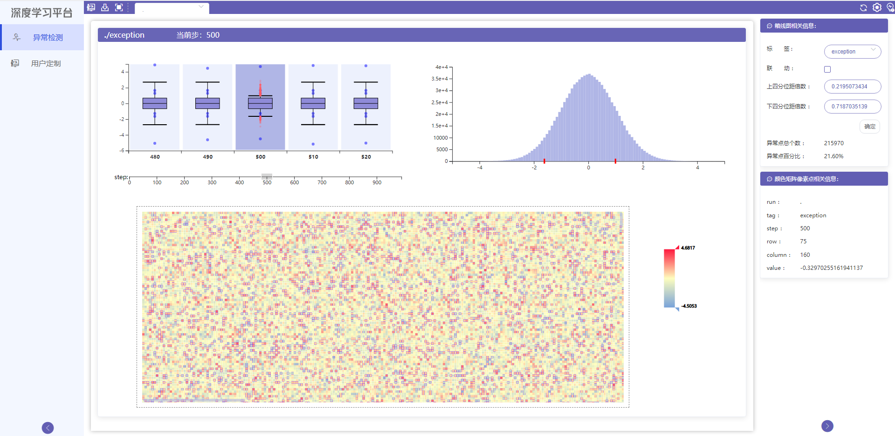
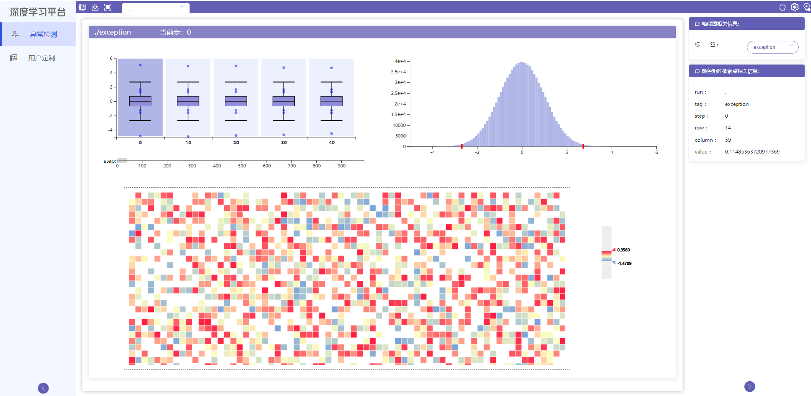

# 统计分析使用教程

## 模块简介

异常检测可视化模块可以把转化成二维的张量用颜色矩阵可视化出来，也可视化了张量数据的统计直方图和盒须图，并通过一些操作帮助用户发现数据中的异常点。

## 模块功能

#### 盒须图：

1. 拖动下方坐标轴上的刷子可查看相应范围内的盒须图；

2. 高亮的盒须图对应的直方图和颜色矩阵绘制在右侧和下方；点击当前高亮盒须图，只会请求异常点数据；点击其它盒须图，不但会请求异常点数据，还会请求直方图和颜色矩阵的新数据。

3. 异常点会在盒须图中用红色圆圈标记出来，在颜色矩阵中异常点对应的矩形的边界也会高亮

4. 异常值的上下边界也可拖拽，停止拖拽时会重新获取新范围外的异常点数据，并重新绘制

   

   

   

   

#### 直方图

数据的统计信息，x轴上的红色标记对应盒须图异常点的上下边界

#### 颜色矩阵

用矩形表示数值点，根据数值大小为矩形赋予一个颜色值

1. 颜色矩阵可以通过滚轮放大缩小，右侧及下方有滚动条

2. 颜色条上下三角形可拖动，制定数据分布的查看范围，数值大小超出上下三角形数值的矩形颜色将会变灰

   

   

   

#### 右侧控制面板

1. 盒线图相关信息

这部分是对选中的盒线图的一些操作控制，其中一些参数的含义如下：

上、下四分位距倍数：调节盒须图异常值的上下边界

联动选择：勾选联动后，盒须图异常值的上下边界会同步变化

调节上下四分位倍数的效果跟拖动盒须图中的异常值上下边界相同

2. 颜色矩阵相关信息

鼠标移至颜色矩阵或盒须图的异常点上，将显示该点所在的行、列、数值大小等

