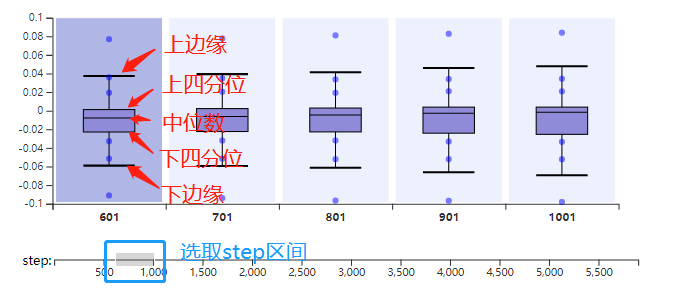

# 异常检测使用教程

## 模块简介

异常检测可视化模块从三个角度可视化一个高维的张量数据：绘制了张量数据一个step的统计直方图和五个step的盒须图，还可以把高维张量转化成二维的张量然后用颜色矩阵可视化出来。三个图表可以实现联动变化，通过丰富的交互操作帮助用户发现数据中的异常点。

{ .img-fluid }

## 各图功能介绍

#### 盒须图表

- 通过滑动下方坐标轴上的透明滑块，选取展示五个step的张量的盒须图。

- 每个盒须图中，有六个蓝色的原点，从下到上依次是张量数据排序后的0、5%、10%、90%、95%、100%的数据；除此之外，其余各变量的标记如下图所示，有上边缘max，下边缘min，上四分位数Q3，下四分位数Q1，中位数Q2

上边缘和下边缘的计算方式如下：

四分位距 $Iqr = Q3 - Q1$，上边缘 $max = Q3 + 1.5Iqr$，下边缘 $min = Q1 - 1.5Iqr$

-  我们默认上下边缘计算时用的是1.5倍的Iqr，在上下边缘外的值都认为是异常值。通过点击盒须图，可以获取到异常值，并用红色的圆点标记出来。

  通过在盒须图上拖拽上下边缘的横线，或是在右侧控制面板中手动输入Iqr的倍数，可以修改异常值的范围，其中联动的操作是让上下边缘一同变化。

#### 颜色矩阵

- 二维矩阵的每个值用一个小矩形表示，不同的值赋予不同的颜色；通过对盒须图的操作得的异常值，这里也会把异常值对应的小矩形边框用紫色高亮出来

- 右侧还有一个颜色映射的颜色条，通过拖拽上下三角形，可以改变颜色映射范围，在映射范围外的值对应的小矩形赋予灰色值

  

- 鼠标悬浮在颜色矩阵上，小矩形对应的数值，该数值所在行列等信息在右侧控制面板中显示

  

- 通过拖拽颜色矩阵右边和下边的滑动条可以查看其余部分的颜色值分布情况，通过鼠标滚轮缩小颜色矩阵，可以查看整体的颜色分布情况

  

- 通过鼠标滚轮缩小颜色矩阵，可以查看整体的颜色分布情况

  

#### 直方图

数据的统计信息，x轴上的红色标记对应盒须图异常点的上下边界

{ .img-fluid }
