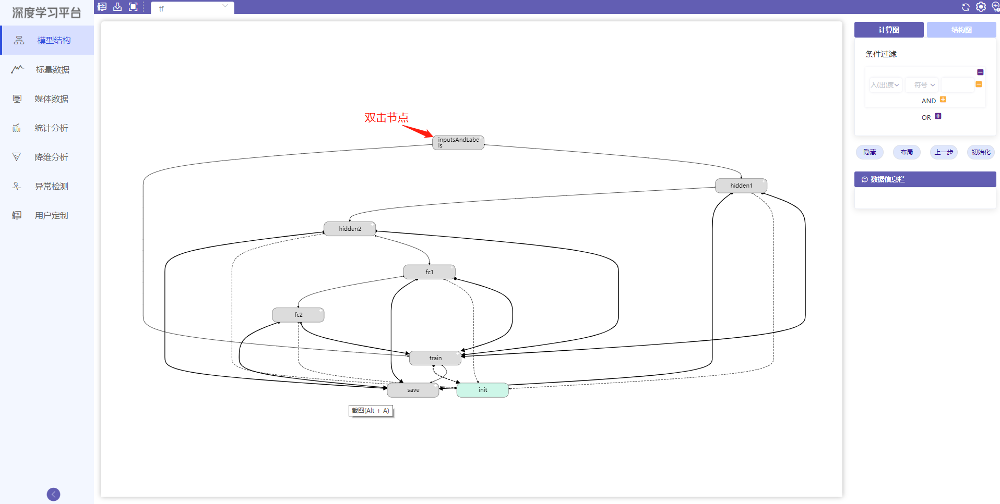
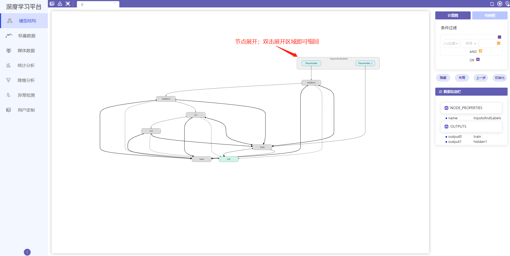
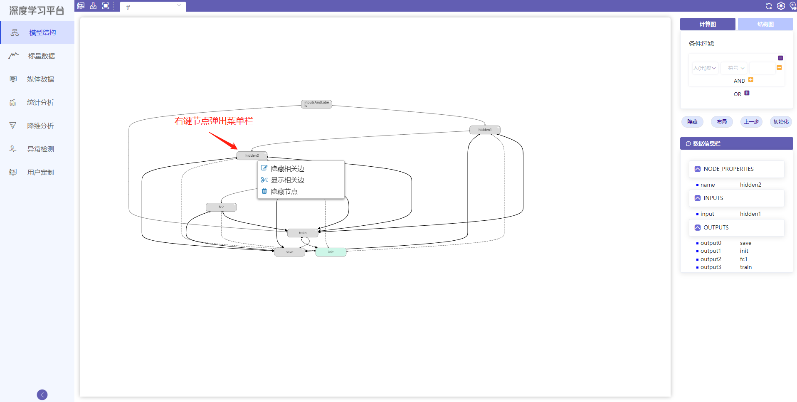
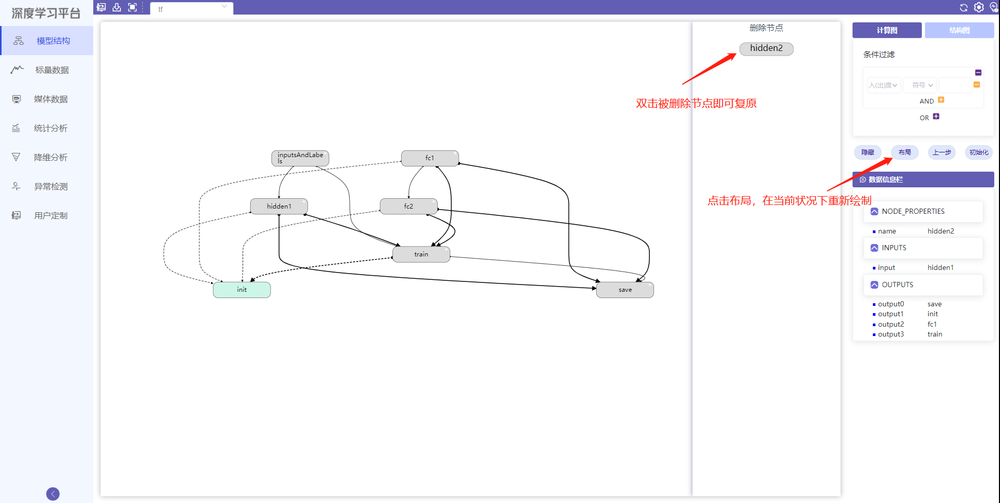
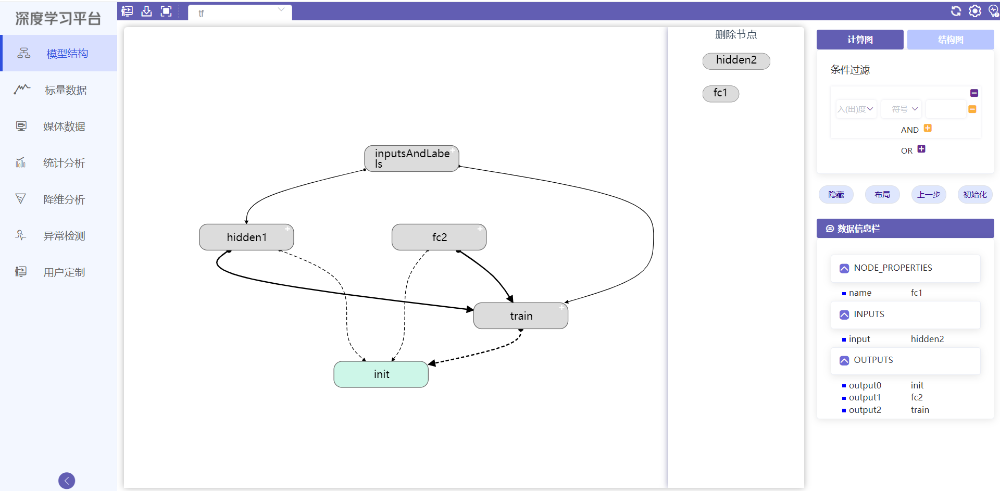
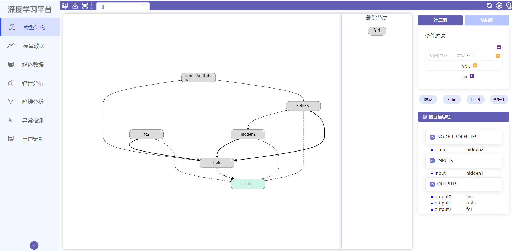
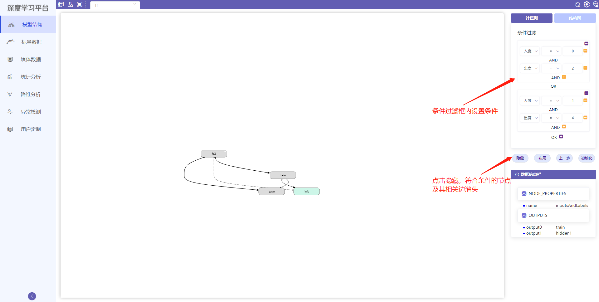
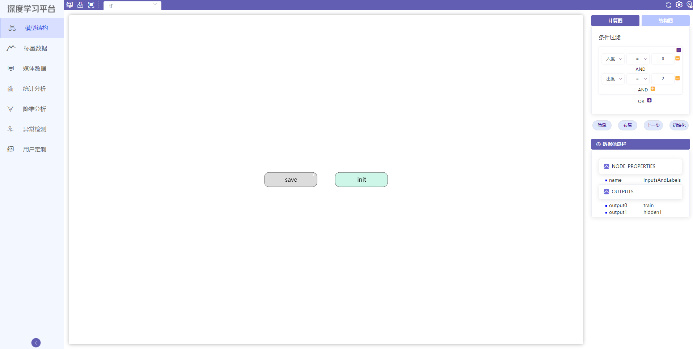
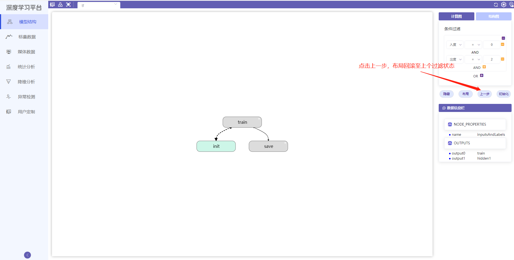
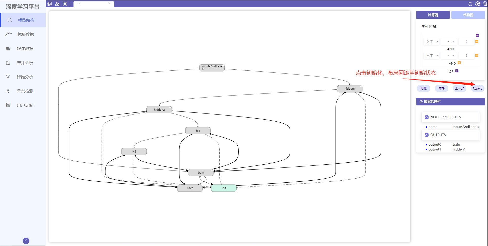

# 模型结构使用教程
## 模块简介
模型结构模块用于展示模型的计算图与结构图。模块使用丰富的颜色来代表不同的神经元层和操作节点；通过隐藏节点的相关边、隐藏节点以及依据节点的出入度过滤节点这三种方法，让模型显示更清晰；通过鼠标可以通过点击节点和连边获得它们的结构信息以及在其上的数据流信息，数据流通过可视化方式展现。

## 模块功能

#### 节点展开:

用户双击左上角“+”标记的节点("+"表示该节点可展开)，节点展开呈现内部结构

{ .img-fluid }

用户双击展开后的节点可以复原

{ .img-fluid }

#### 单击节点获取信息:

用户单击节点，节点高亮，相关边变红。相关节点边框变红，节点信息在数据信息栏中显示

{ .img-fluid }

#### 隐藏相关边，复原相关边:

1.用户右键单击节点，弹出菜单项，选择边隐藏，相关边消失，节点变灰；

2.用户再次右键单击节点，弹出菜单项，选择边，相关边复原，节点颜色复原

{ .img-fluid }

{ .img-fluid }

#### 隐藏节点:

用户右键单击节点，弹出菜单项，选择隐藏节点，相关边消失，节点消失，出现在“删除节点”栏中；

{ .img-fluid }

{ .img-fluid }

用户点击布局按键，结构图重新绘制

{ .img-fluid }

用户可以继续隐藏节点

{ .img-fluid }

用户双击“删除节点”栏中节点(本示例中为“hidden2”)，节点复原

{ .img-fluid }

#### 批量隐藏:

用户在“条件过滤”设置条件，点击隐藏按键，符合条件的节点及相关边消失

{ .img-fluid }

用户点击布局按键，结构图重新布局

{ .img-fluid }

在布局基础上继续隐藏...

{ .img-fluid }

继续隐藏...

{ .img-fluid }

用户点击“上一步”，结构图回到上步隐藏结果

{ .img-fluid }

用户点击初始化，回到原始状态

{ .img-fluid }
