# 模型结构使用教程
## 模块简介
模型结构模块用于展示模型的计算图与结构图。模块使用丰富的颜色来代表不同的神经元层和操作节点；通过隐藏节点的相关边、隐藏节点以及依据节点的出入度过滤节点这三种方法，让模型显示更清晰；通过鼠标可以通过点击节点和连边获得它们的结构信息以及在其上的数据流信息，数据流通过可视化方式展现。
## 模块功能
1.节点展开

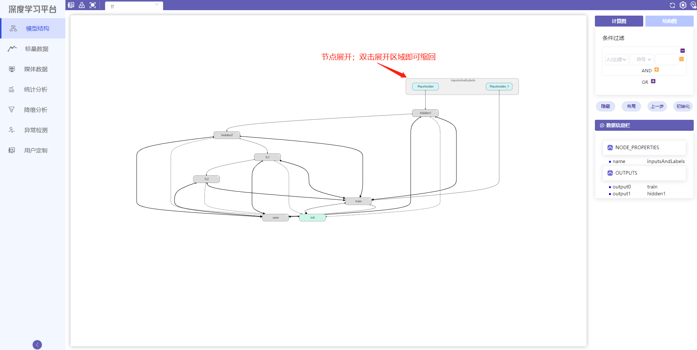

2.单击节点获取信息

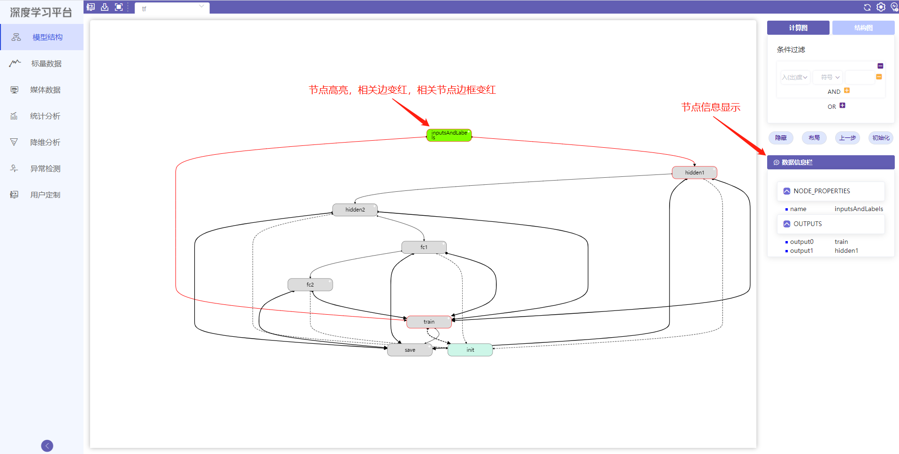

3.隐藏相关边，复原相关边

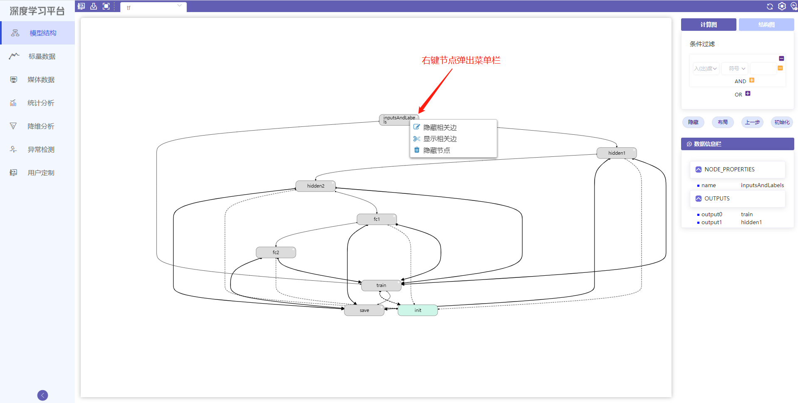

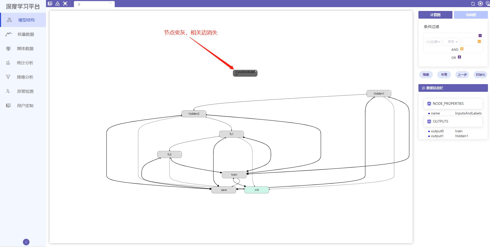

4.隐藏节点

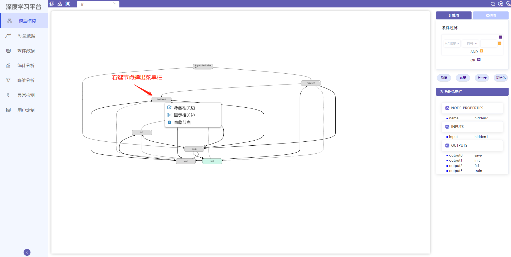

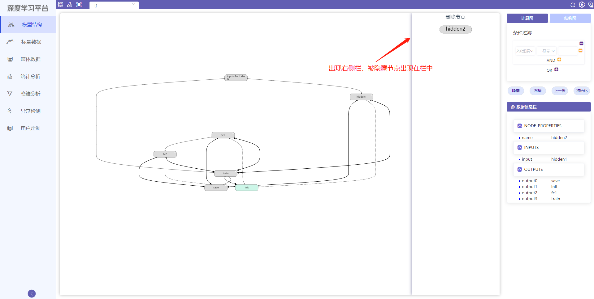

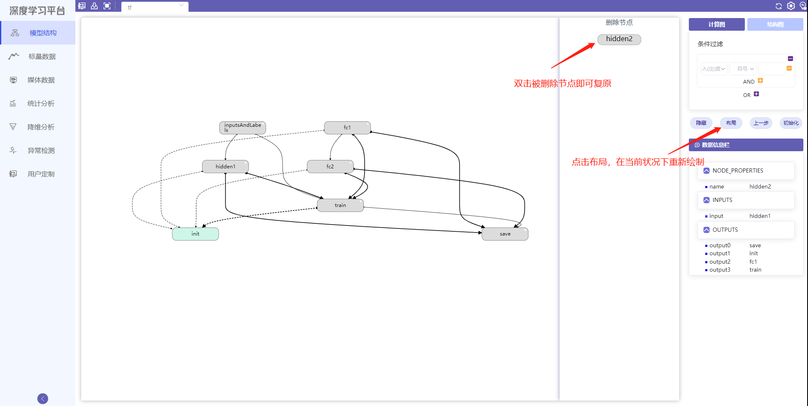

5.批量隐藏

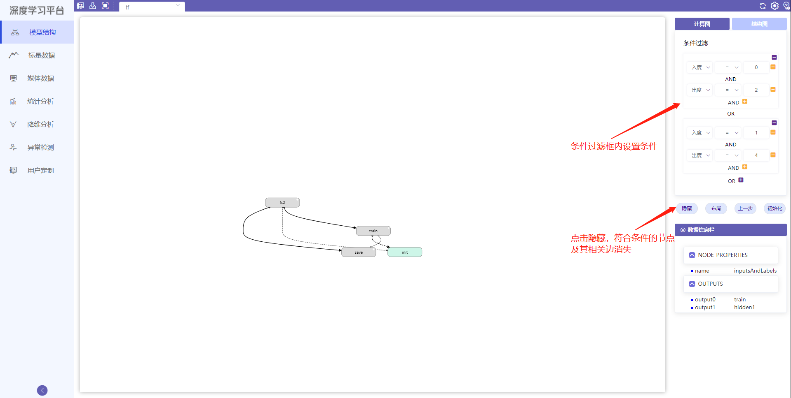

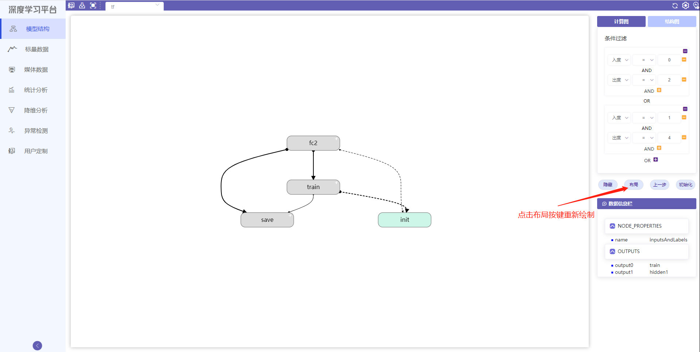

在布局基础上继续隐藏...
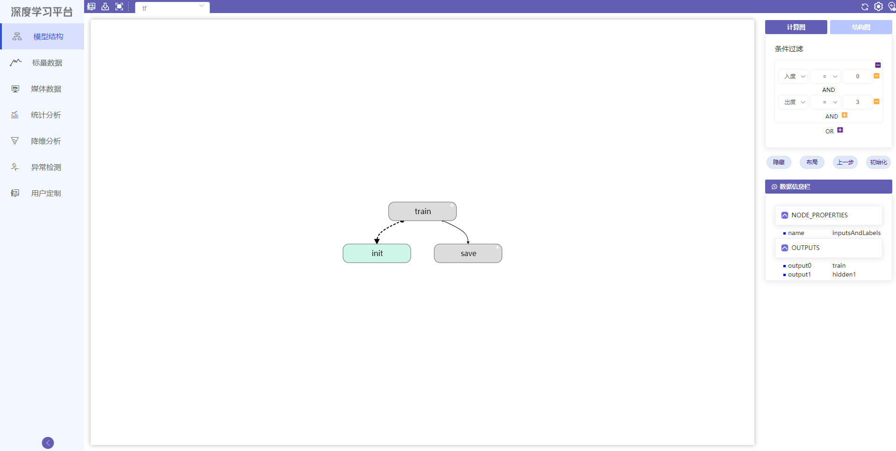

继续隐藏...
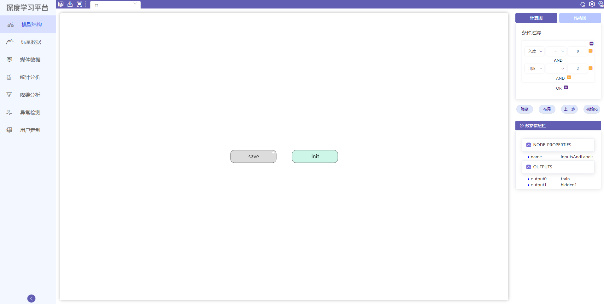

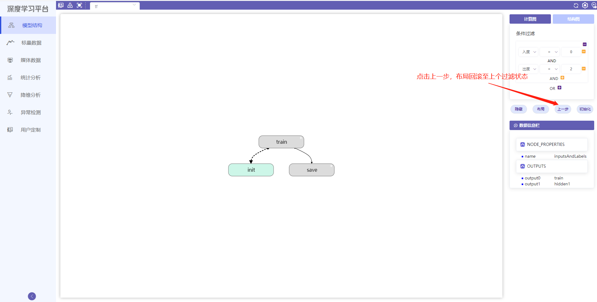

