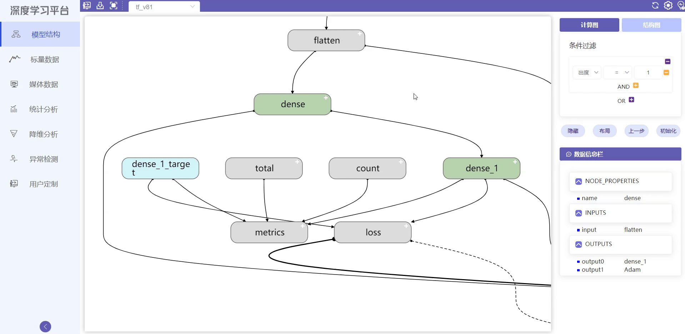

# 模型结构使用教程
## 模块简介
模型结构模块用于展示模型的计算图与结构图。模块使用丰富的颜色来代表不同的神经元层和操作节点；通过隐藏节点的相关边、隐藏节点以及依据节点的出入度过滤节点这三种方法，让模型显示更清晰；通过鼠标可以通过点击节点和连边获得它们的结构信息以及在其上的数据流信息，数据流通过可视化方式展现；结构图部分展示不同方法的特征图及神经网络的分类数据

## 模块功能

#### 节点展开:

1.用户双击右上角“+”标记的节点("+"表示该节点可展开)，节点展开呈现内部结构

2.用户双击展开后的节点可以复原

{ .img-fluid }

#### 单击节点获取信息:

用户单击节点，节点高亮，相关边变红。相关节点边框变红，节点信息在数据信息栏中显示

{ .img-fluid }

#### 隐藏相关边，复原相关边:

1.用户右键单击节点，弹出菜单项，选择边隐藏，相关边消失，节点变灰；

2.用户再次右键单击节点，弹出菜单项，选择边，相关边复原，节点颜色复原

{ .img-fluid }

#### 隐藏节点:

用户右键单击节点，弹出菜单项，选择隐藏节点，相关边消失，节点消失，出现在“删除节点”栏中；

用户单击“删除节点”栏中节点，相关节点以红色(出)和蓝色(入)高亮；

用户双击“删除节点”栏中节点，节点复原

{ .img-fluid }

#### 批量隐藏:

用户在“条件过滤”设置条件，点击隐藏按键，符合条件的节点及相关边消失；

用户点击布局按键，结构图重新布局；

用户点击“上一步”，结构图回到上步隐藏结果；

用户点击初始化，结构图回到原始状态；

用户展开或缩回节点操作后结构图恢复原状

{ .img-fluid }

#### 展示特征图：

用户在特征图方法选择下拉框中选择一种方法

用户在有标记的节点上点击，在右侧显示特征图，可以在特征图展示区域横向滚动预览

用户点击展示显示特征图按钮，特征图显示区域扩大

用户将鼠标放置在特征图上时，会显示通过神经网络这张图片的分类信息

{ .img-fluid }

#### 特征图分类信息展示

用户选择一种特征图方法，点击有标记的节点

用户点击更多可以获取更多图片的特征图

用户点击显示分类结果按钮，每张特征图出现红色或绿色边框，红色代表分类错误，绿色代表分类正确

用户点击清空，清除特征图展示区域所有特征图

{ .img-fluid }