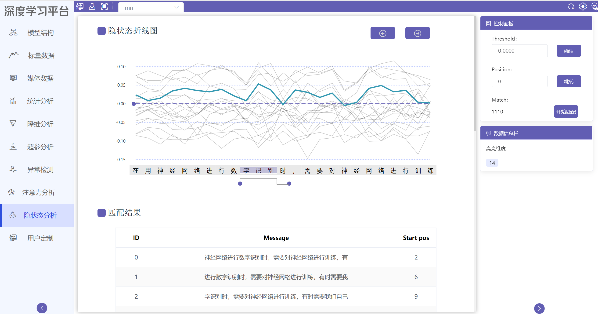
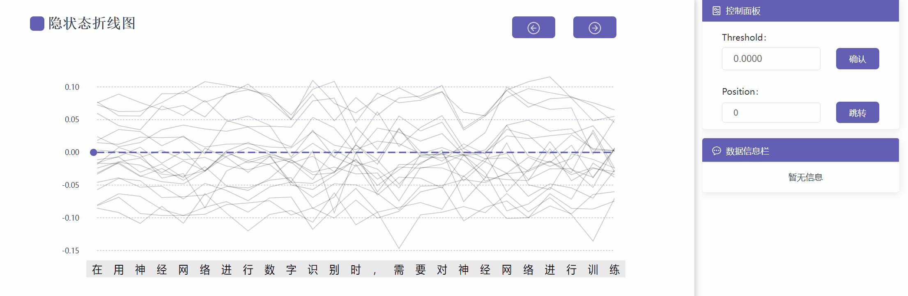
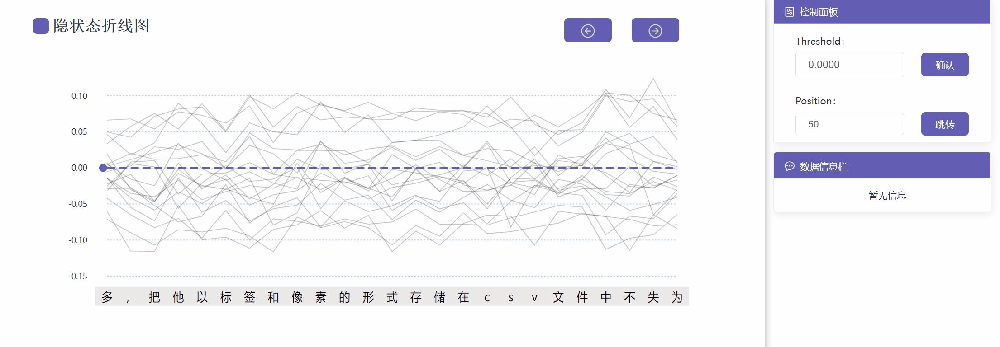
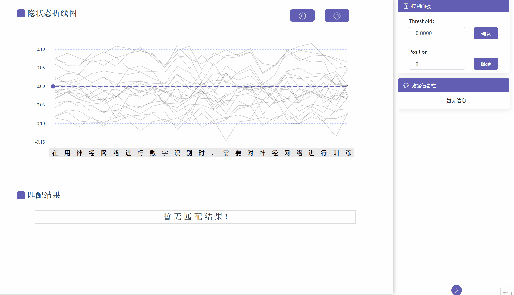

# 隐状态分析使用教程

## 模块简介
隐状态分析模块用于展示RNN模型训练过程中所产生的隐状态数据，将隐状态数据的每一维数据可视化一条直线，通过递进的文本输入，展现维度数据的变化。用户可点击左右按钮及设置跳转位置进行任意位置的跳转。通过设置阈值，用户可在文本带上选择滑动区域进行过滤操作，观察符合匹配模式的隐状态数据维度，结果由蓝色线条高亮显示。同时点击匹配按钮可全局搜索输入文本中和所选区域内符合相同模式的文本，展示在匹配结果表格中。

## 整体界面
{.img-fluid }

## 功能操作说明

### 整体演示

### 左移右移、跳转
用户可点击左移右移按钮，按照固定步数更新折线图，也可以通过设置指定位置，直接进行跳转。

### 阈值过滤
用户可设置阈值Threshold过滤在指定范围内大于阈值的隐状态数据维度。

### 模式匹配
用户在选定滑动范围时，可选择匹配模式，中间阴影区域为大于阈值（记录为1），两侧为小于阈值（记录为0），通过匹配模式字符串匹配整个输入文本中的相同模式区域。

