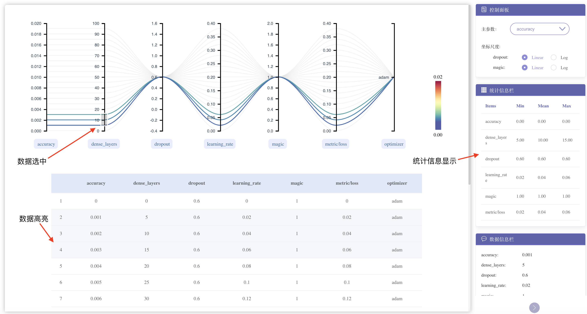
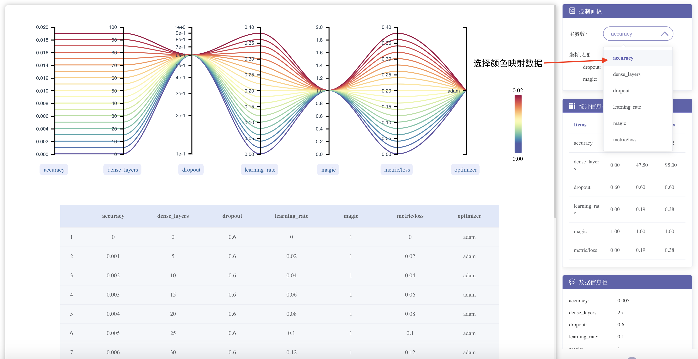
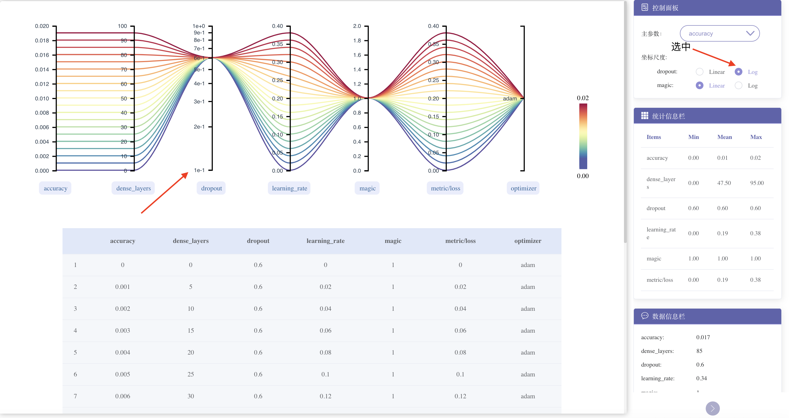

# 超参分析使用教程
{ .img-fluid }

## 模块简介

对模型训练中的超参数进行可视化分析。本模块包含平行坐标系和表格。平行坐标系显示不同超参数组合下的趋势；表格显示每条具体数据。

## 模块功能

1. 通过鼠标选取坐标轴上部分数据

{ .img-fluid }

2. 修改颜色映射数据

{ .img-fluid }

3. 选择不同坐标轴便于观察数据

{ .img-fluid }
