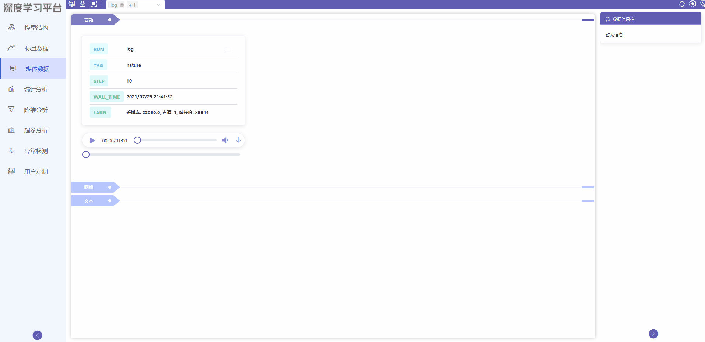
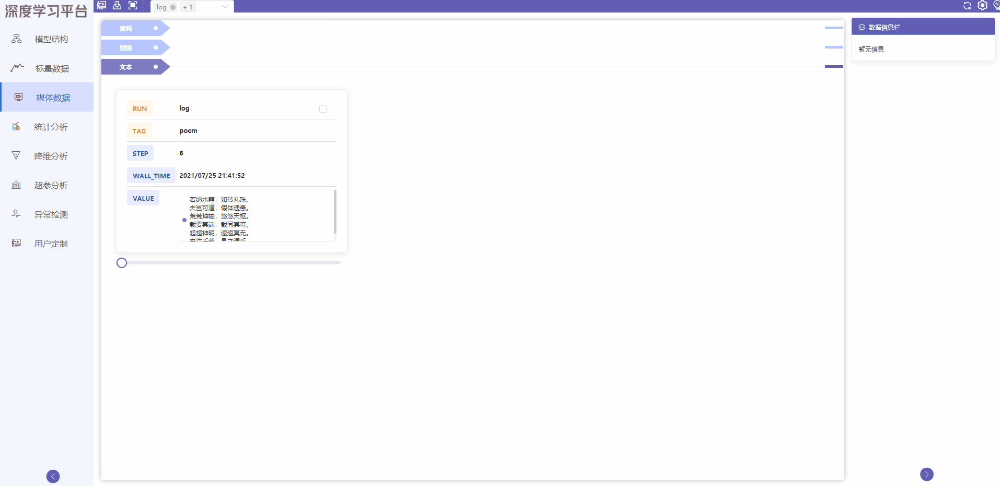

# 媒体数据使用教程
## 模块简介
媒体数据模块用于显示训练数据集的三种数据，包括音频文件，图像文件以及文本文件。用户可对媒体数据文件进行查看以及用户定制功能。
## 模块功能
### 1. 音频文件

文件信息标识：

RUN: 训练模型名称

TAG: 媒体数据所属类别

STEP: 迭代步数

WALL_TIME: 训练绝对时间

LABEL: 音频信息

用户可以先查看上述的文件信息。点击播放按钮，播放所选step的音频文件；点击或拖动快进播放音频；点击喇叭按钮，可静音；点击下载按钮，可选择是否下载音频到本地。

{ .img-fluid }

### 2. 图像文件

文件信息标识：

RUN:训练模型名称

TAG:媒体数据所属类别

STEP:迭代步数

用户可以在左上角先查看上述的文件信息。点击或拖动原点可查看多个step的图片；点击图片本身可对单张图片做一些操作：点击缩小或放大图片；点击恢复原图；点击按钮左旋转或者右旋转图片。

{ .img-fluid }

### 3. 文本文件

文件信息标识：

RUN:训练模型名称

TAG:媒体数据所属类别

STEP:迭代步数

WALL_TIME:训练绝对时间

VALUE:文本具体内容

用户可以先查看上述的文件信息，点击或拖动原点可查看多个step的文本信息。

{ .img-fluid }

### 4. 用户定制

用户可勾选多种数据文件到用户定制页面进行分析。

{ .img-fluid }