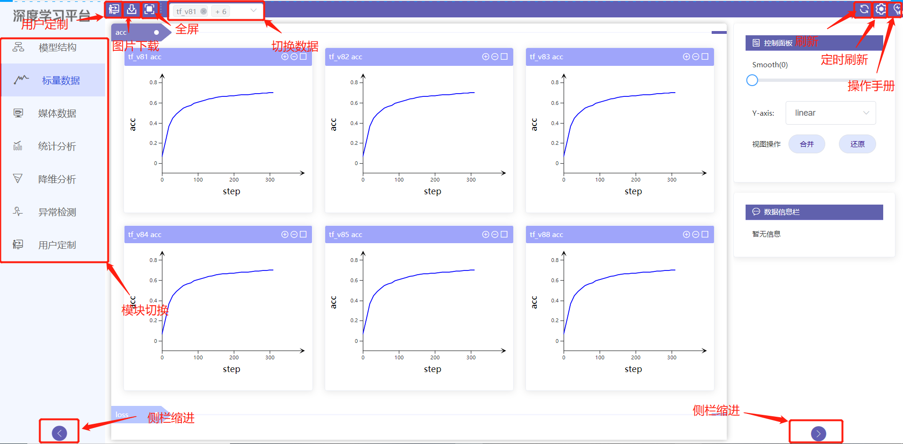

# 主界面

## 主界面功能

平台主界面提供了10个功能:

- 用户定制按键，该功能具体参考[用户定制模块](../custom)。
- 图片下载，当前支持模型结构、标量数据、统计分析三个模块的png/eps格式图片下载。
- 全屏按键。
- 数据切换，用于切换模块内显示的数据。
- 刷新数据，更新模块内显示的数据。
- 定时刷新数据。
- 操作手册。
- 模块切换，用于切换模型结构，标量数据, 媒体数据，统计分析，降维分析，超参数分析，异常检测，用户定制8个模块。
- 模块栏缩进。
- 操作栏缩进。

{ .img-fluid }

