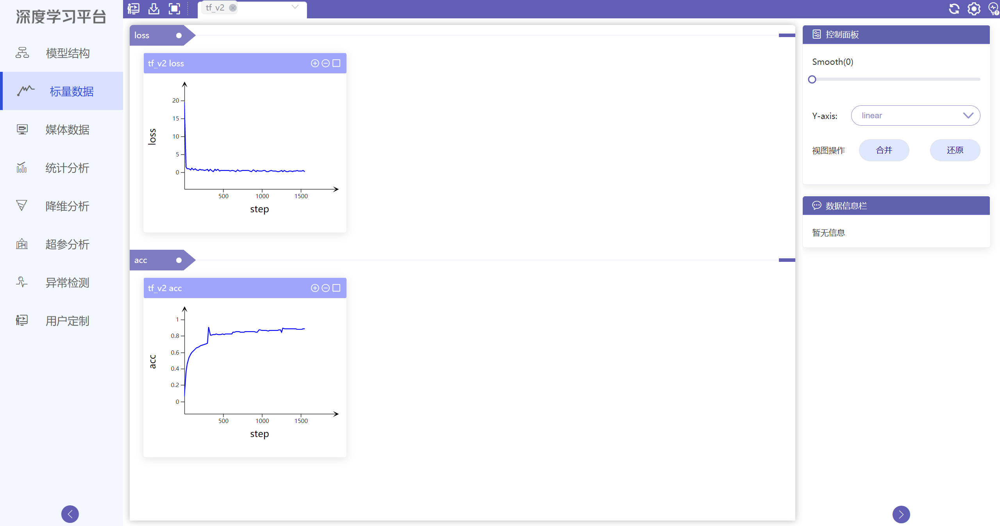
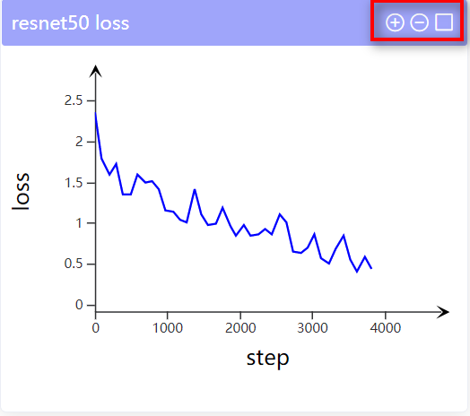
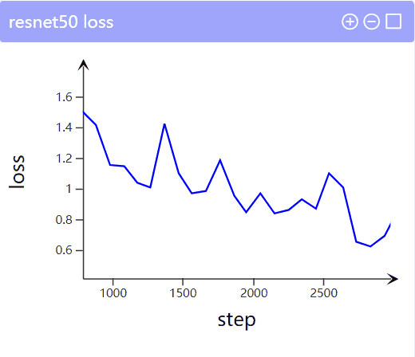
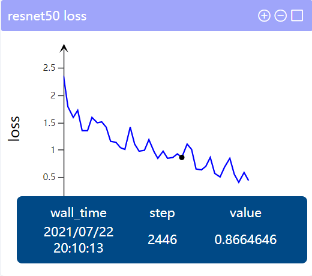
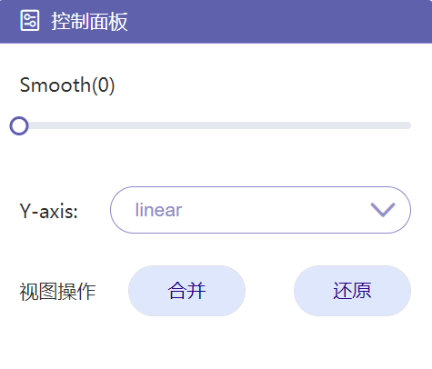
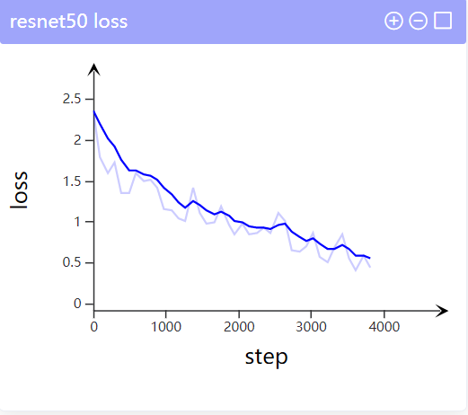
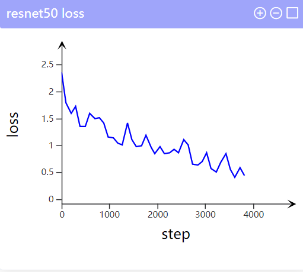
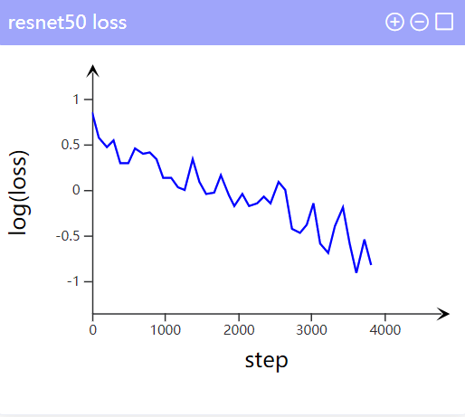
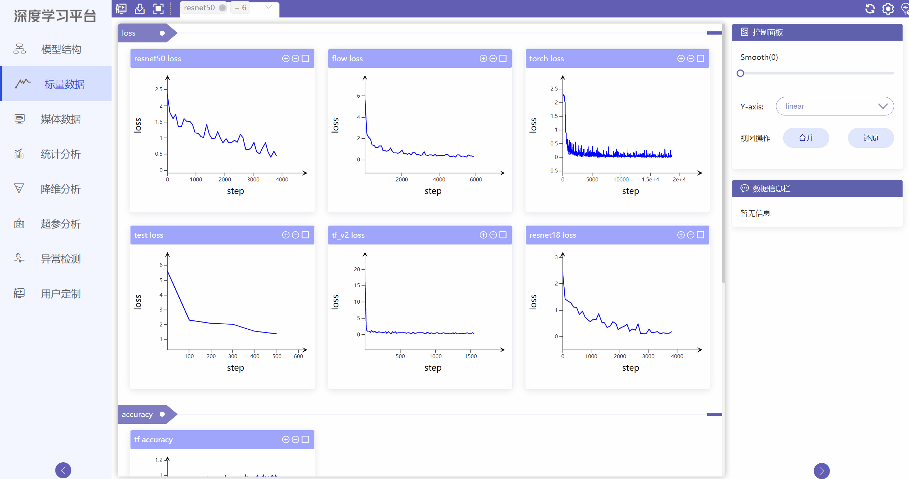
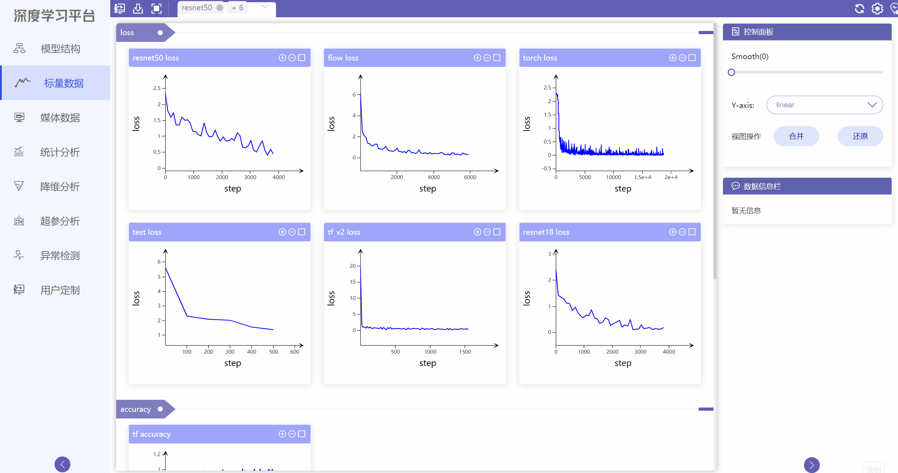

# 标量数据使用教程

## 模块简介
标量数据模块用于展示模型训练过程中所产生的一些标量数据，包括训练loss，模型accuracy，网络每层的bias和weight等。用户可以在统计图上观察标量数据随训练过程的变化情况，底部的统计信息可以显示用户鼠标所选点的详细信息，同时可以选择全局放大或局部放大来深入研究。右侧为控制面板，用户可以更改统计图曲线的平滑程度以及数据的统计方式。用户也可以通过选取多张统计图进行合并研究，点击还原按钮恢复多张统计图。

## 模块界面

{ .img-fluid }

## 功能操作说明
### 支持数据图[放大]、[还原]、[选中]

### 支持选取局部区域放大，双击还原

### 数据点Hover展示详细信息

wall_time:训练绝对时间

step:迭代次数

value:训练过程标量值

### 控制面板

4.1 曲线平滑度设置，以便更好的展现参数整体的变化趋势

平滑度=0.7（实线）vs 平滑度=0（虚线）

4.2 y轴坐标转化

采用linear和log_linear两种显示方式

### 数据图合并与还原

用户可以勾选两张数据图，点击合并按钮，生成合并数据图，观察比较曲线变化。点击还原按钮，恢复多张原图（目前支持两张图的合并，多选会提示超出选择限制）。

{ .img-fluid }

### 用户定制

用户可勾选标量数据里的多张数据图，点击用户定制按钮，跳转到用户定制界面进行分析。

{ .img-fluid }
