# 标量数据使用教程
## 模块简介
标量数据模块用于展示模型训练过程中所产生的一些标量数据，包括训练loss，模型accuracy，网络每层的bias和weight等。用户可以在统计图上观察标量数据随训练过程的变化情况，底部的统计信息可以显示用户鼠标所选点的详细信息，同时可以选择全局放大或局部放大来深入研究。右侧为控制面板，用户可以更改统计图曲线的平滑程度以及数据的统计方式。用户也可以通过选取多张统计图进行合并研究，点击还原按钮恢复多张统计图。
## 模块功能
1.显示训练标量数据

训练loss，模型accuracy，网络每层的bias和weight等标量数据

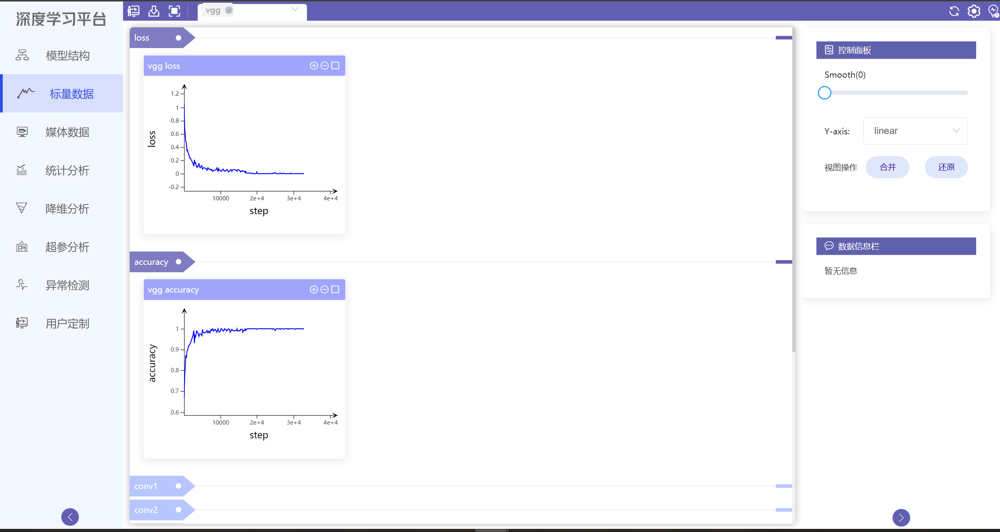
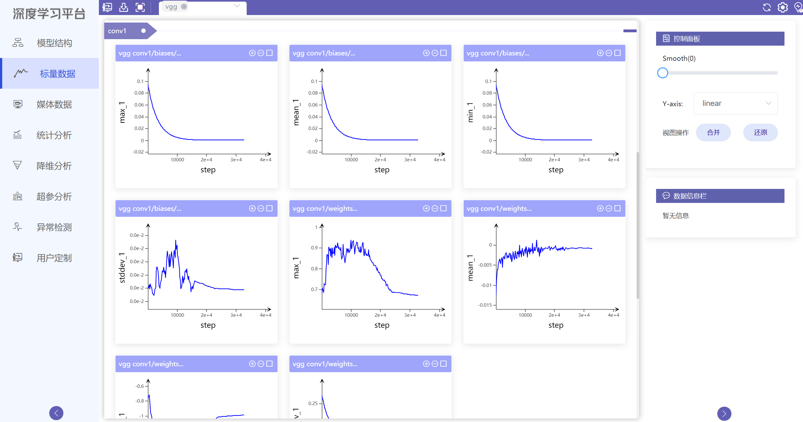

2.显示所选点信息

鼠标可在曲线上移动，底部显示所选点信息

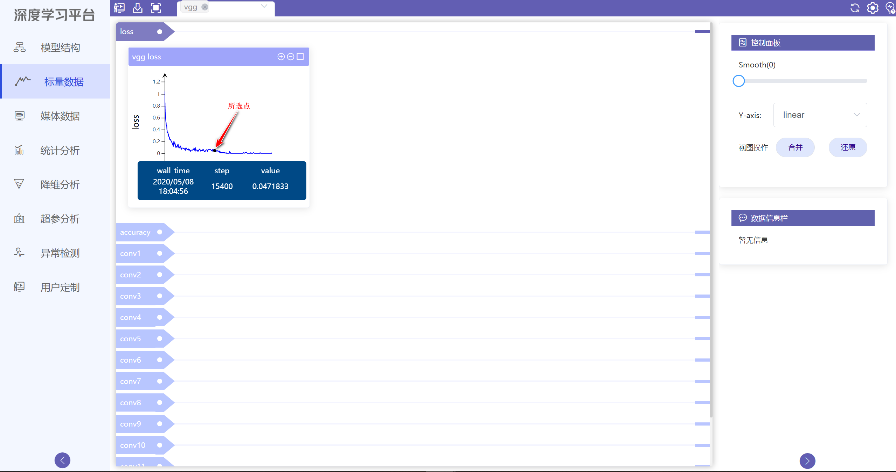

3.全局放大与局部放大

用户点击全局放大按钮，得到全局放大图。在全局放大状态下，点击全局缩小按钮，恢复原图

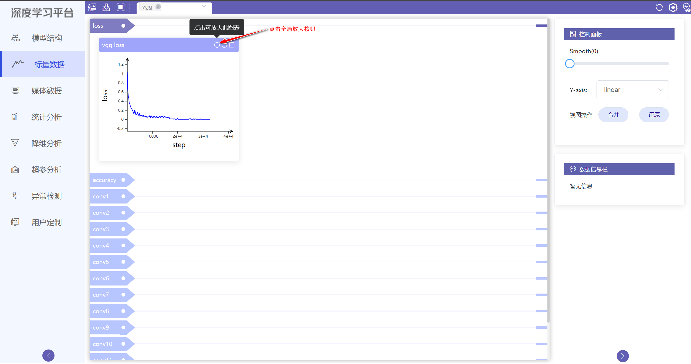
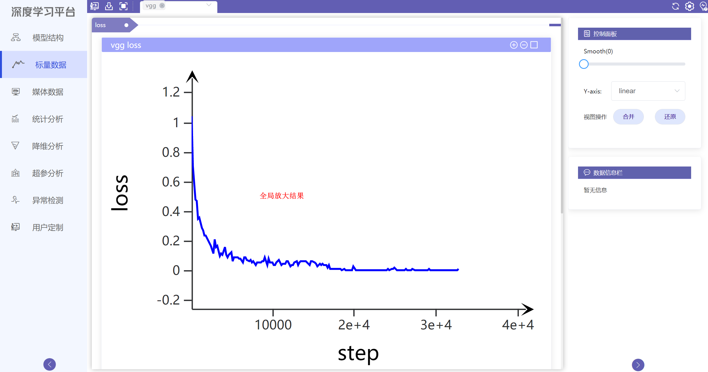
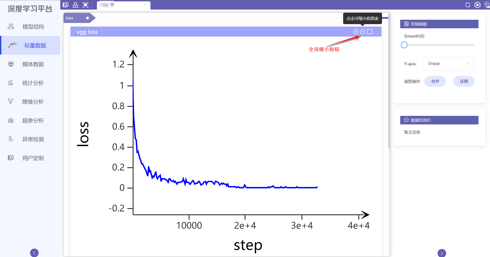

用户可按住鼠标左键圈选区域，得到局部放大图，双击左键恢复原图。
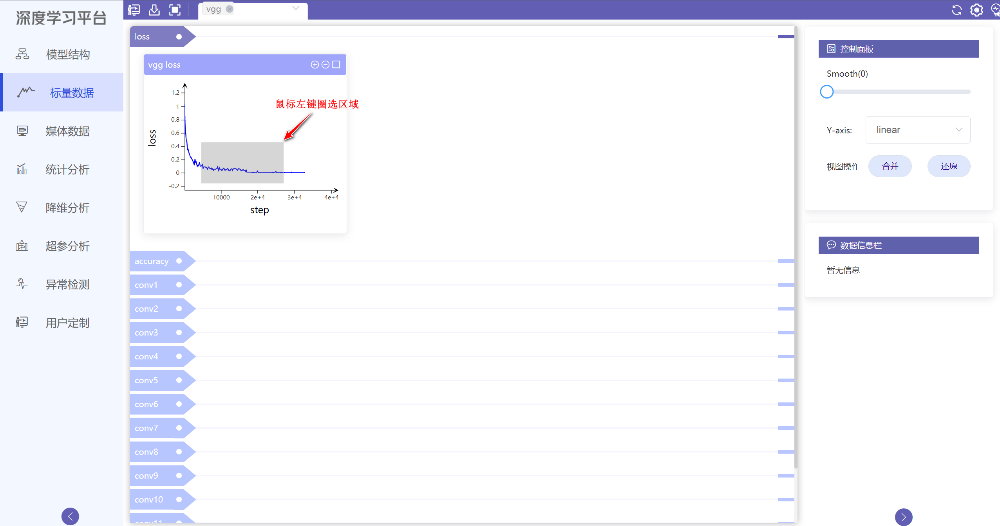
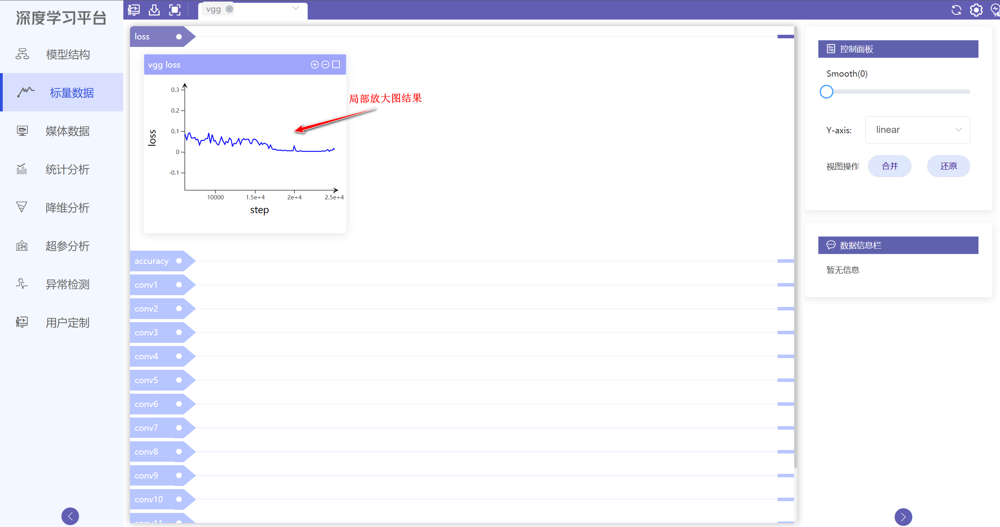

4.曲线平滑度设置

用户可在数据控制面板调整曲线的平滑度，范围为0-0.9，0为原曲线，0.9为最大光滑曲线。
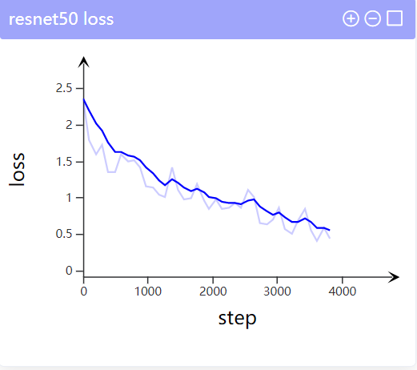
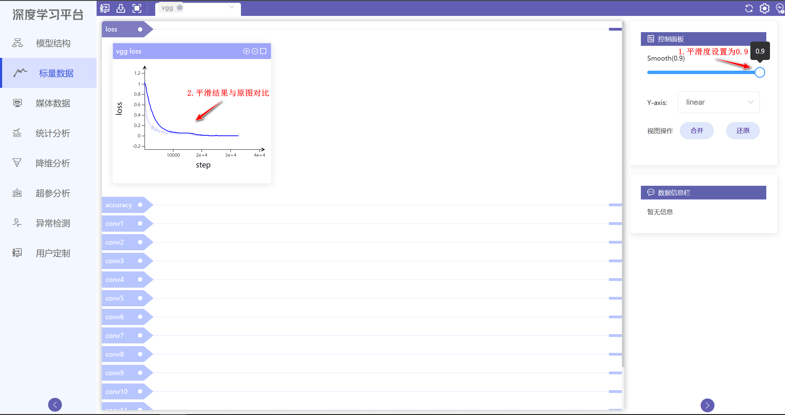

5.y轴数据显示
用户可选择对数据进行取对数处理再显示。

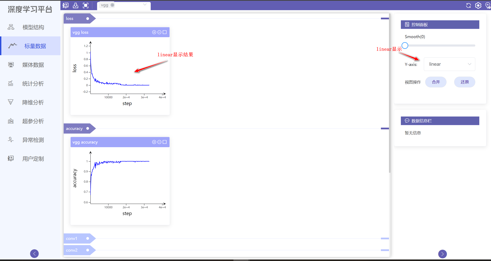
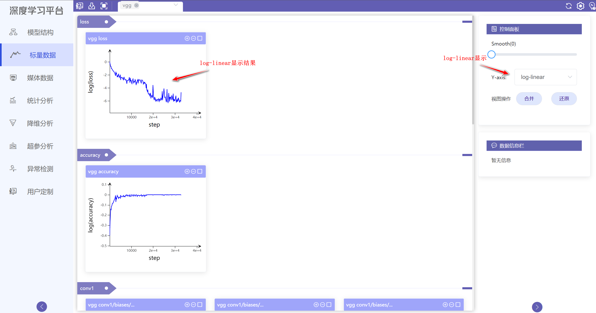

6.数据图合并与还原

用户可以勾选多张数据图，点击合并按钮，生成合并数据图。点击还原按钮，恢复多张原图。
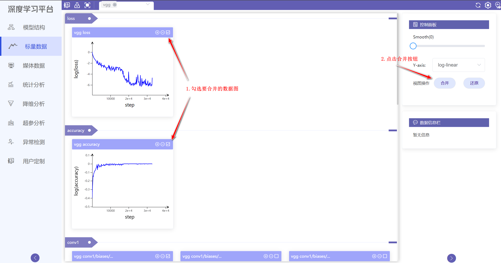
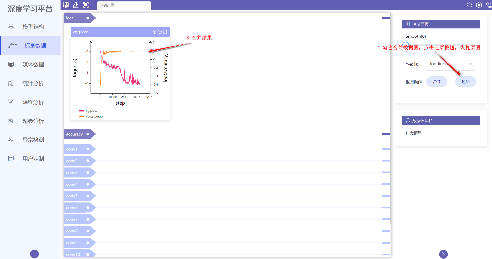

7.用户定制

用户可勾选标量数据里的多张数据图，点击用户定制按钮，跳转到用户定制界面进行分析。
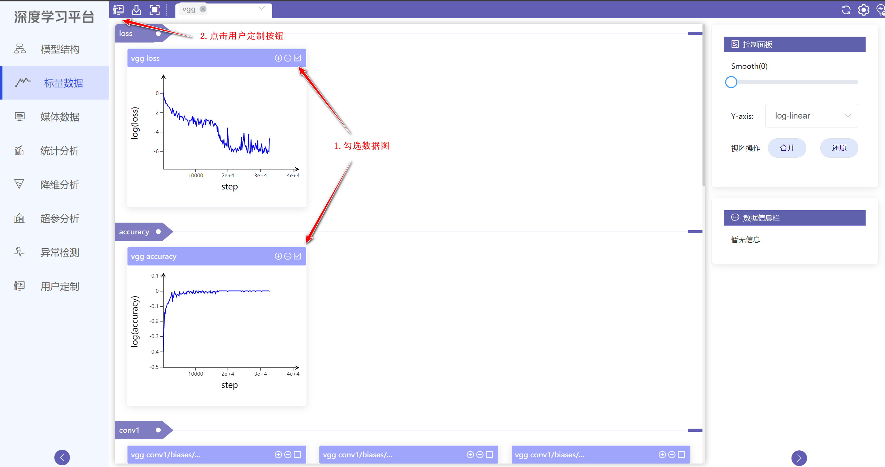
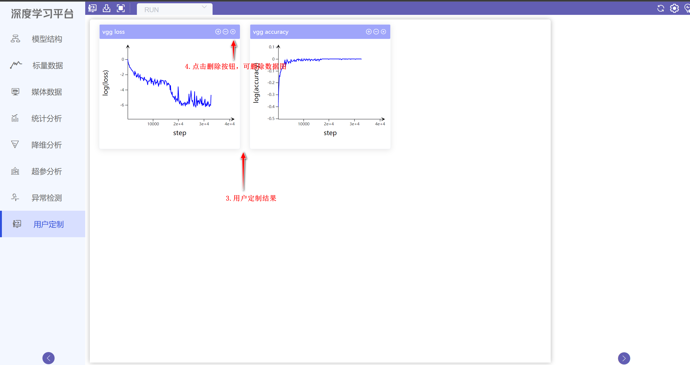
