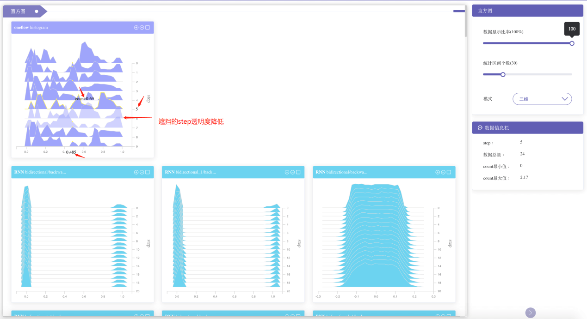
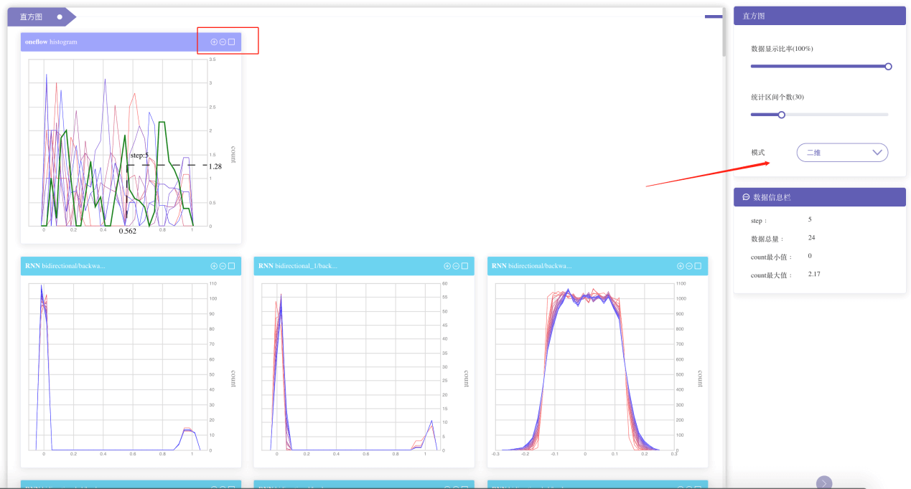
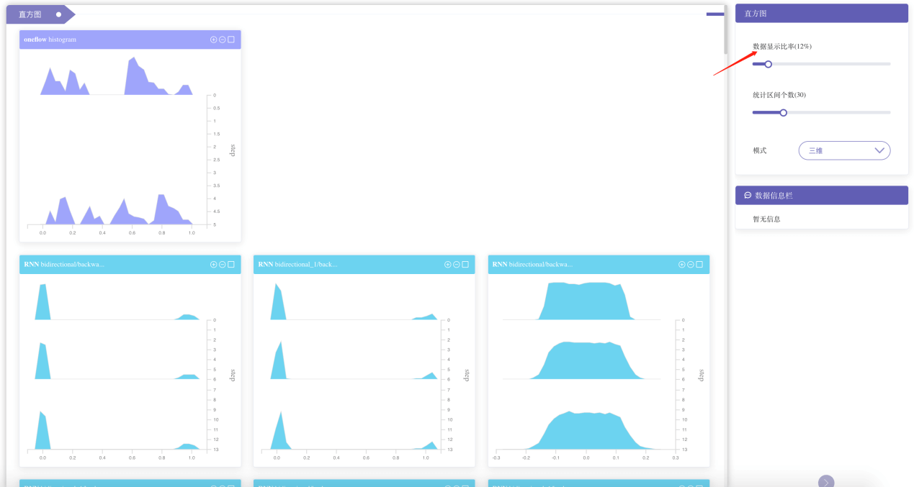
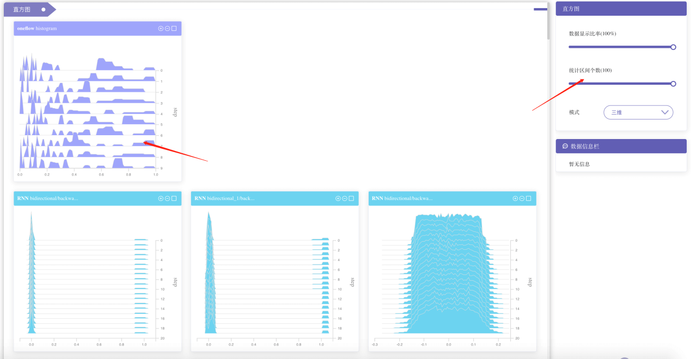
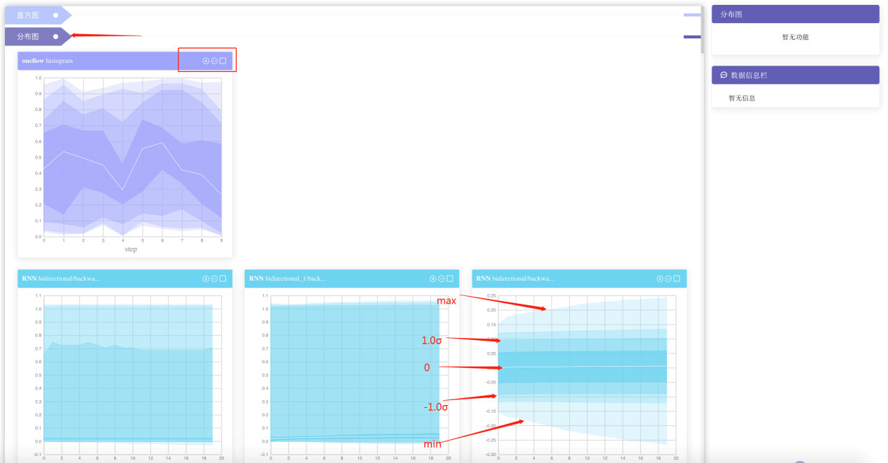

# 统计分析使用教程

## 模块简介

对模型训练过程中产生的张量数据在每个step的分布进行统计分析后，统计分析可视化模块可对统计数据进行可视化，本模块包括两种统计图：直方图和分布图。直方图是对每个step中该张量各值出现的次数进行统计；分布图是把数据转换到正态分布时的统计。

## 模块功能

#### 直方图

1.  鼠标悬浮在直方图上会高亮相应step直方图的边界，并且遮挡住该step数据的直方图的透明度会降低

2.  直方图会在x轴、y轴和鼠标位置显示鼠标最近点对应的value、step和count，表示当前点是第step步上的一个点，落在以value为中心的区间的值有count个

3. 「数据信息栏」将会显示该step的一些统计信息

4.  其他 step 对应同一 value 值的点将会用圆点标记出来

   

5.  每一直方图右上角有放大缩小按钮。右上角矩形框为「用户定制」所用，选中后再按「定制」按钮就可以把数据迁移至「用户定制」页面

6.  直方图有两种模式：三维模式和二维模式。二维模式可以视为三维模式的正视图，操作同三维直方图

   

7. 「控制面板」 — 「数据显示比率」：按百分比选择显示多少条 step 数据

   

   

8. 「控制面板」— 「统计区间个数」：统计区间个数越大，区间范围越小，越接近真实值

   

#### 分布图

分布图用于展示转换为标准正态分布下的数据分布，数据转换成标准正态分布后的分布图，从上到下一共九条线，分别为：最大值、1.5σ、1.0σ、0.5σ、0、-0.5σ、-1.0σ、-1.5σ、最小值

每一分布图右上角有放大缩小按钮，右上角矩形框为「用户定制」所用，选中后再按「定制」按钮就可以把数据迁移至「用户定制」页面

