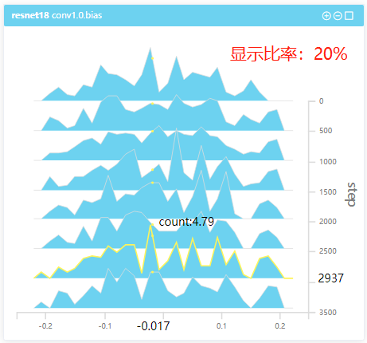

# 统计分析使用教程

## 模块简介

模型训练过程中产生的张量数据，后端对其多个step的值分别进行统计分析，前端统计分析可视化模块可对统计后的数据进行可视化。

本模块包括两种统计图：直方图和分布图。直方图是对每个step中该张量各值出现的次数进行统计；分布图是把数据转换到正态分布时的统计。

{ .img-fluid }

## 模块功能介绍

#### 直方图

##### 单个直方图的基础功能

- 鼠标悬浮在直方图上会高亮相应step直方图的边界，并且遮挡住该step数据的直方图的透明度会降低

- 直方图会在x轴、y轴和鼠标位置显示鼠标最近点对应的value、step和count，表示当前点是对第step步上张量数据的统计结果，表示落在以value为中心的区间的值有count个
- 同时，右侧控制面板的「数据信息栏」将会显示该step张量的一些统计信息
- 同时，其他 step 对应同一 value 值的点将会用黄色圆点标记出来
- 每一直方图右上角有放大缩小按钮。右上角矩形框为「用户定制」所用，选中后再按「定制」按钮就可以把数据迁移至「用户定制」页面

  

##### 直方图全局功能

- 直方图有两种模式：三维模式和二维模式。二维模式可以视为三维模式的正视图，操作基本同三维直方图，鼠标悬浮可以高亮选中的step数据，该step张量的统计信息会展示在右侧的控制面板中

   

- 「控制面板」 — 「数据显示比率」：按百分比选择显示多少条 step 数据

  下面左图是100%的数据显示比率，数据很密；右图是20%的数据显示比率，数据比较稀疏

   

- 「控制面板」— 「统计区间个数」：统计区间个数越大，区间范围越小，越接近真实值

  下图中左图的统计区间个数是20，曲线比较平滑；右图的统计区间个数是100个，分段更多

   

##### 样式特点

本页面提供了11种配色，可以为每个run赋予不同的颜色，直方图和分布图都有这种样式特点

   

#### 分布图

- 分布图用于展示转换为标准正态分布下的数据分布，数据转换成标准正态分布后的分布图，从上到下一共九条线，分别为：最大值、1.5σ、1.0σ、0.5σ、0、-0.5σ、-1.0σ、-1.5σ、最小值

- 每一分布图右上角有放大缩小按钮，右上角矩形框为「用户定制」所用，选中后再按「定制」按钮就可以把数据迁移至「用户定制」页面
