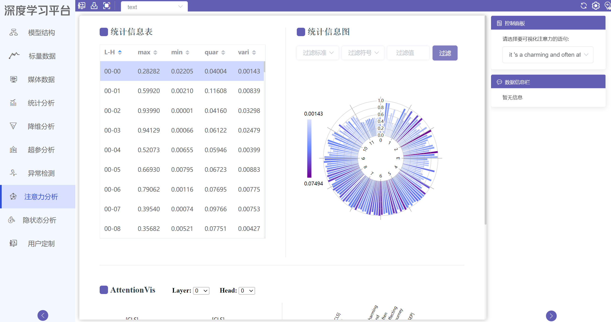
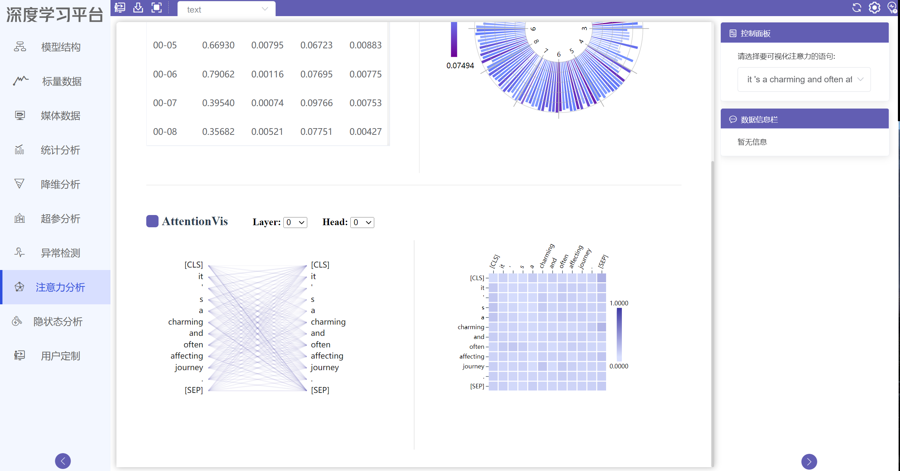
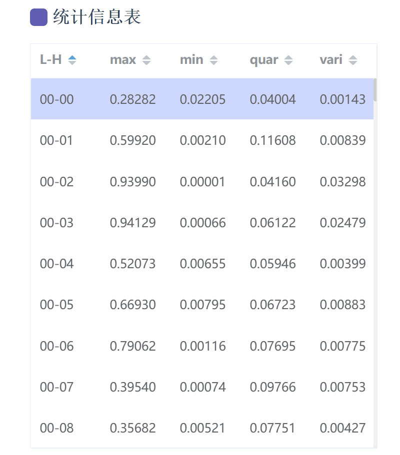
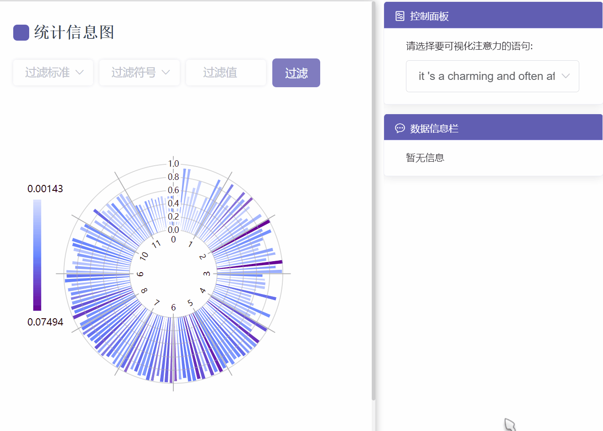
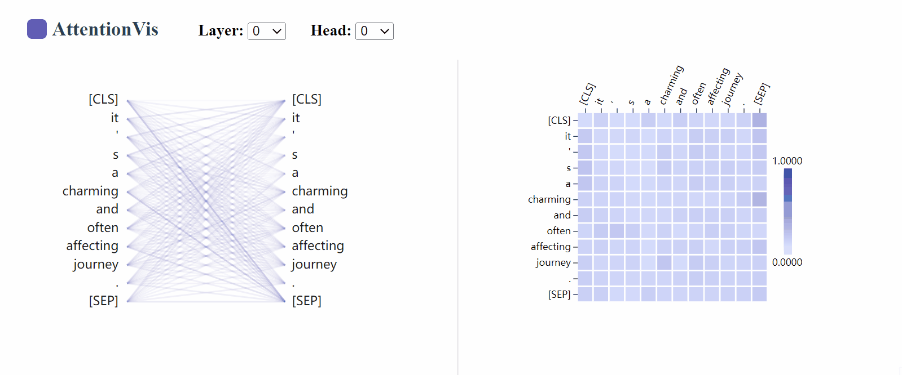
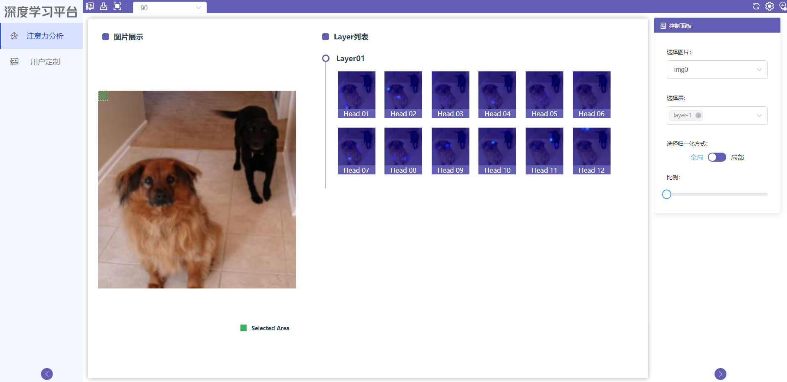
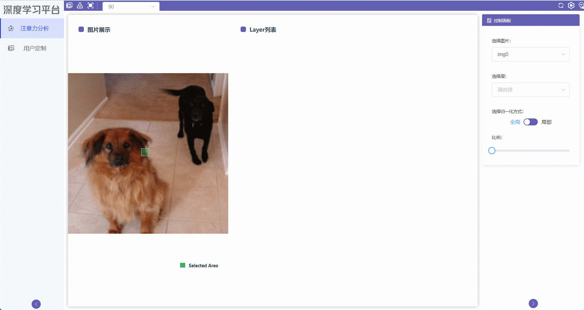
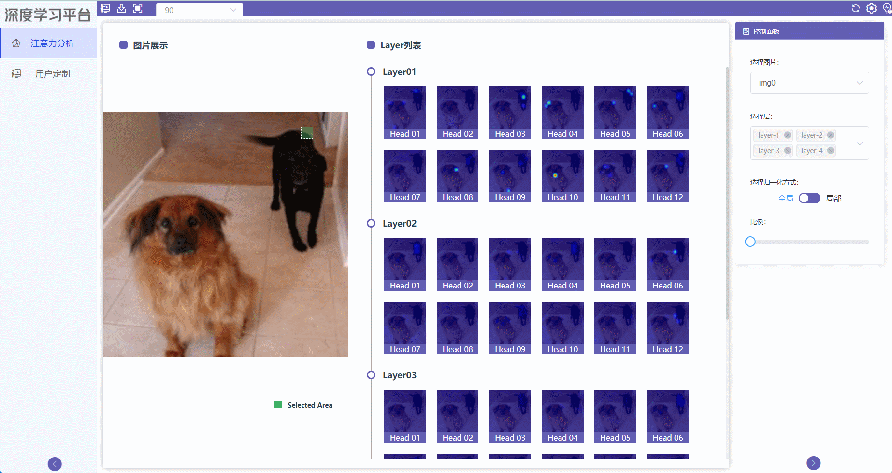
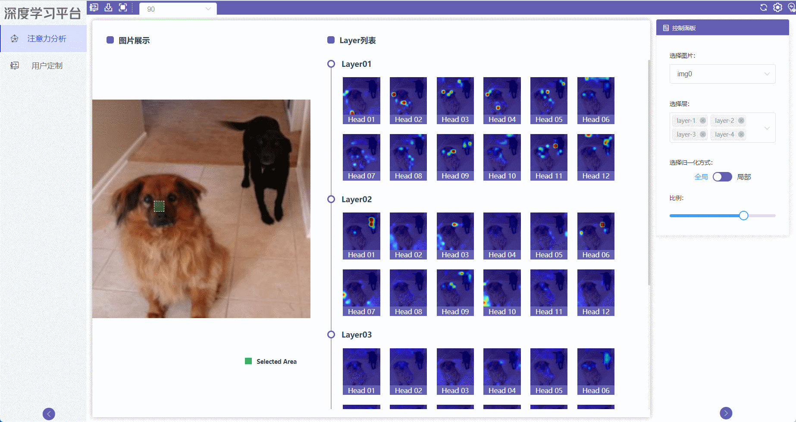

# 注意力分析使用教程

## 模块简介
注意力分析模块用于展示Transformer模型训练过程中所产生的注意力数据，包括图像注意力数据和文本注意力数据，对于图像注意力数据，可以点击图片的某块区域，获取其他区域与该区域的注意力数据分析图；可以选择不同的层和头展示不同的注意力数据；可以选择不同图片展示注意力数据；可以切换全局和局部注意力，在全局模式下可以调整注意力比例，获取更为明显的注意力图像。对于文本注意力数据，首先以表格和环形图的方式展现全部层和头注意力数据的大体情况，用户可通过观察表格数据，在环形图中过滤出感兴趣的注意力头。在选定某个注意力头后，用户可在AttentionVis区域查看具体的注意力联系情况，分析出具体的注意力分布模式。

## 文本注意力界面
{.img-fluid }

{.img-fluid }

## 功能操作说明

### 整体演示

### 统计信息表
展示所有注意力头中注意力的最大值、最小值、四分位差及方差，帮助用户了解整体注意力数据，所选头已高亮，用户可点击表头上下箭头进行升序或降序排序。

### 统计信息图
以环形图的方式展现图表数据，每个柱形图代表一个注意力头，柱形图的起始点标识最小值和最大值，颜色标识方差大小。将鼠标悬停在柱形图上方时，会有相应的提示框提示相应头的具体信息，同时右侧的数据信息栏也会展示相应信息。通过上方的过滤操作，可展示过滤后符合条件的注意力头。

### AttentionVis
通过统计信息表和统计信息图了解全部注意力头数据后，用户可选定单个注意力头，通过两种展现形式具体查看相应数据，通过选择不同的layer和head，用户可逐一查看所有头的注意力信息数据。

### 语句选择
用户可通过下拉框选择不同语句文本展示不同的注意力数据。

## 图像注意力界面

### 展示特征图
用户点击选择层，选择不同的Layer，可以通过全选按钮选择全部层，点击选择框中的已选择的层后的叉号可以取消该层的选择，点击图片区域可以选择展示不同区域的激活图

用户可以选择不同的归一化方式，全局或者局部，在全局选项下，可以通过调节原图和激活图组合的比例查看更明显的激活图

用户可以通过选择图片对当前日志下的其他图片进行展示

